# Types of statistics
1. Descriptive
	- Collecting, Organising, Summarising, Presenting data
2. Inferential (extrapolating to a broader context)
	- Making Inferences
	- Hypothesis testing
	- Making predictions
	- Determining relationships

Example:

| Descriptive                                                       | Inferential                                                    |
| ----------------------------------------------------------------- | -------------------------------------------------------------- |
| 210 (75%) of these 280 people have the last name Nicolussi        | 75% of all people living in Italy have the last name Nicolussi |
| Henry averaged 1 new car sold, per Sunday, for the last 3 Sundays | Henry never sells more than 2 cars on a Sunday                 |

# Linking descriptive & inferential statistics
Probability Theory is the basis to link Descriptive and Inferential.  
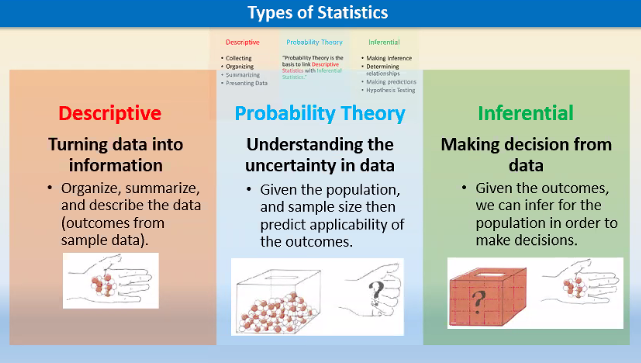

# Sample vs Census
## Census
the whole population  
Measuring the census is:
- costly
- impractical/impossible (changes to the population etc.)

## Sample
A small subset of the population.  
Measured and used to infer properties of the whole population  
Sampling/measuring

## Symbols used for Population & Sample
| Population | Sample    | Parameter/Statistic |
| ---------- | --------- | ------------------- |
| $\mu$      | $\bar{x}$ | mean                |
| $\sigma^2$ | $s^2$     | variance            |
| $\sigma$   | $s$       | standard deviation  |
| $p$        | $\hat{p}$ | proportion          |
The word "Statistic" is a numerical summary computed from a sample (sample mean, sample proportion, sample variance) (Not to be confused with "Statistics" - branch in Mathematics)

Parameter is a numerical summary computed from a population.

# Types of data
## Qualitative (categorical)
- can be named in a list or enumerated
- split into various discrete categories
- cannot compare values in a sense of being larger or smaller

Example:
- Racial-ethnic Group
- Political Party
- Vegetarian

## Quantitative (numerical)
- Consists of a set of values

Example:
- age, height, weight, BMI
- GPA
- Time spent on Internet yesterday
- Reaction time to a stimulus

### 2 types of Quantitative variable
#### Discrete (countable)
A set of possible **separate** numbers
#### Continuous (non-countable)
An infinite continuum of possible **real number values**
- A variable that can be measured infinitely in terms of decimal etc.
- Infinite precision

# Representation of categorical data
## Bar Chart & Pie Chart
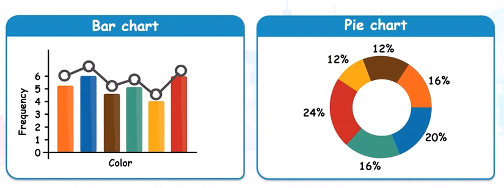

## Relative Frequency
The collection of all categories and the corresponding relative frequencies is called the relative frequency distribution of the variable

Definition:  
Population Proportion / Relative Frequency:

$$
p_{i} = \frac{f_{i}}{N}
$$

Sample Proportion:

$$
\hat{p_{i}} = \frac{f_{i}}{n}
$$

where,

$$
\begin{gathered}
f_{i}=\text{frequency}\\
N=\sum f_{i}~~~\text{(all data)}\\
n=\text{size of the sample}
\end{gathered}
$$

Example:

| Color  | Relative Frequency |
| ------ | ------------------ |
| Red    | 0.24               |
| Blue   | 0.20               |
| Green  | 0.16               |
| Orange | 0.16               |
| Brown  | 0.12               |
| Yellow | 0.12               |
# Representation of quantitative data
## Relative Frequency Table
Numeric data can be represented by a frequency distribution

Example:  
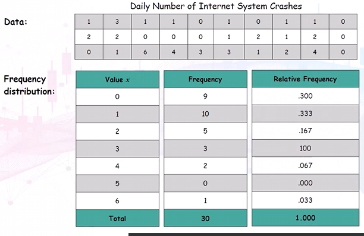

## Histograms
can be used to visualise quantitative data relatively

Bins are contiguous intervals that group continuous data values for a histogram. Each bin covers a range (e.g., 0–9.9, 10–19.9)

Comparison:  
Histograms
- Used for quantitative or continuous data
- Displays data **continuously**
- No bar spacing
- Gaps = means value zero for that class
- Bar width: Can be different in length to represent classes, bins
- Bars cannot be reordered
Bar Chart
- Used for categorical or discrete data
- Have bar spacing, separated by gaps
- Bar widths are arbitrary, no meaning
- Bars can be reordered

Example histogram:  
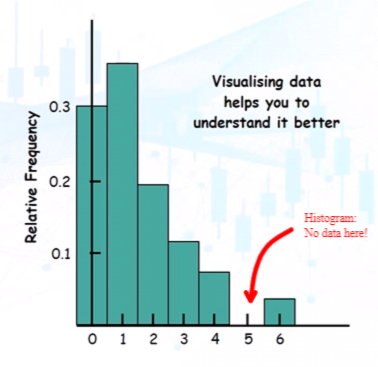

## For Continuous Quantitative data / Large Dataset
Create frequency table to classify numerical data into categories
- Classify into 5 to 14 classes to be visually accessible to most people
- Commonly, classes that cover continuous non-overlapping range of values

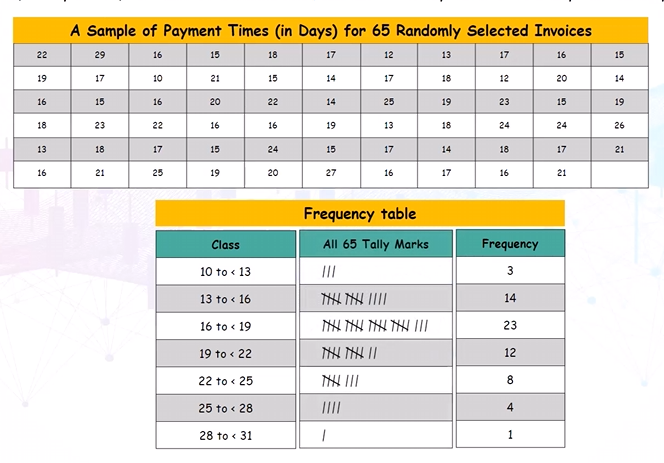
### Frequency Histogram 
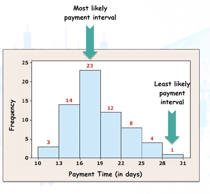

### Relative Frequency Histogram
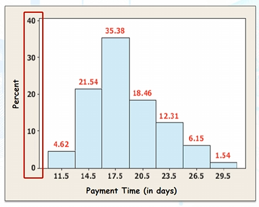  
y axis is % of total frequency  
x axis is average of each range

# Categorising irregular data (unequal bin widths)
Irregular Data:  
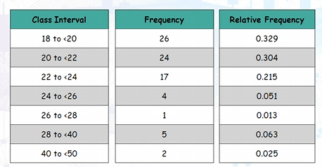

Problem: Possible misinterpretation using relative frequency histogram  
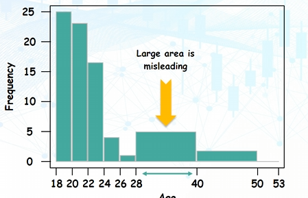

## Solution: Calculate density
Histogram needs to be drawn using density when presenting continuous data with unequal class width.

$$
\text{Density}=\frac{\text{Relative Frequency}}{\text{Class Width}}
$$

Class Width is the range of the current class (i.e. 18 to <20 -> 2)

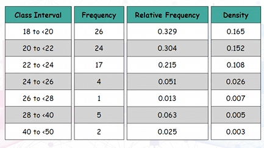

Density Histogram:  
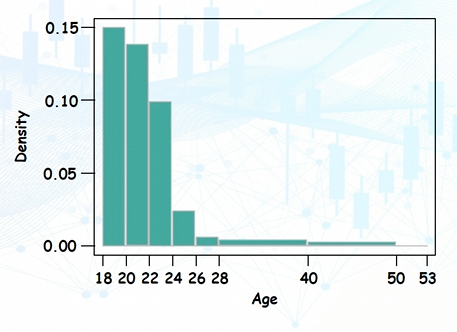

# Bivariate Data
means data involving 2 variables

## Crosstabulation
method of pairing 2 variables against one another, and summarising it into a **contingency table**.

Example:  
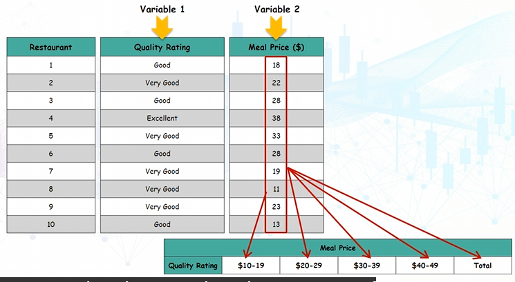
- Place the meal prices into categorical ranges (turn quantitative -> categories)
Contingency table:
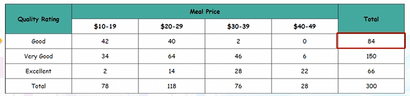

We can also turn entries into row% or column%
- Row Percentages are based on the total on the right:
	- 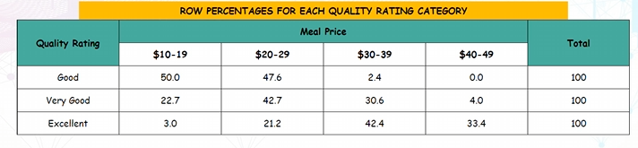

### Crosstabulation using clustered/stacked bar chart
- May be presented easier graphically  
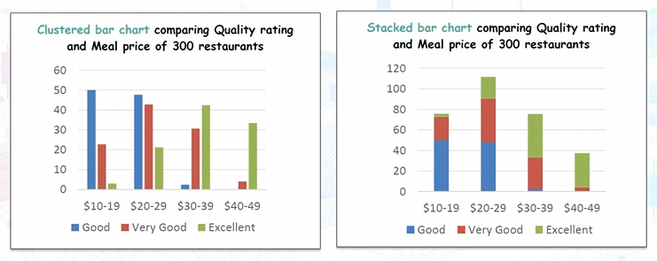

# Measure of Location
Expressing a group of data in a single value

3 most commonly used measures of location:
- Mean
- Median
- Mode

## Mean
Population mean:

$$
\mu = \frac{x_{1}+x_{2}+\dots+x_{N}}{N}=\frac{\sum X_{i}}{N}
$$

where $x_{1},x_{2},\dots,x_{N}$ are ALL N data in the population

Sample mean:

$$
\bar{x} = \frac{x_{1}+x_{2}+\dots+x_{n}}{N} =\frac{\sum X_{i}}{N}
$$

where $x_{1},x_{2},\dots,x_{N}$ is a subset of n< N data in the population

Calculating mean: $\frac{\text{Total data}}{\text{Total Frequency}}$

### Mean: example for grouped data
Data has been **aggregated** into ranges

Example:  
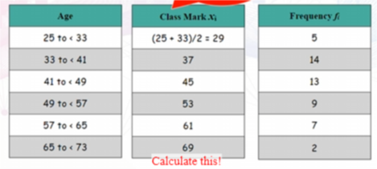
1. Calculate the average of each class boundary
2. Multiply the average by frequency, and sum all of it to determine the total data

$$
\bar{x}= \frac{\sum x_{i}f_{i}}{n}
$$

3. Sum all frequency, to determine total frequency
4. $\bar{x}=\frac{\text{Total data}}{\text{Total Frequency}}$

## Median
defined as the middle data value when the dataset has been ordered from the smallest to the largest

| Data         | Order        | Median      |
| ------------ | ------------ | ----------- |
| 3,9,1,4,5    | 1,3,4,5,9    | 4           |
| 3,9,1,4,5,10 | 1,3,4,5,9,10 | (4+5)/2=4.5 |

### Median: example for grouped data
Median Q is the **interpolated** value within the class containing the median computed

Formula:

$$
Q=L_{m}+\left( \frac{\frac{n}{2}-cf_{m-1}}{f_{m}} \right)w_{m}
$$

where  
n: number of data  
$L_{m}$: lower bound of class containing median  
$f_{m}$: frequency of class containing median  
$W_{m}$: width of class containing median  
$cf_{m-1}$: **cumulative** frequency of the class(es) before the class containing median

To find the class containing the median, take the $\frac{\text{total frequency}}{2}$ and pinpoint to the corresponding class...

Example:  
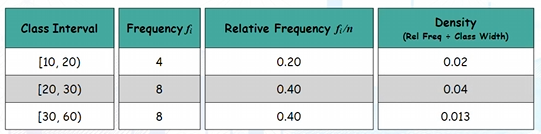  
Use the formula:  

$$
\begin{gathered}
Q = 20 + \frac{\frac{20}{2}-4}{8}\times 10 \\
=27.5~~~~~~~~~~~~~~~~~~~
\end{gathered}
$$

## Mode
Mode is defined as the data value that has the highest frequency.  
Mode can be used for qualitative and quantitative data.

Example:

| Data                | Order               | Mode |
| ------------------- | ------------------- | ---- |
| 4,8,1,3,4,3,3,2,4,4 | 1,2,3,3,3,4,4,4,4,8 | 4    |
### Mode: example for grouped data
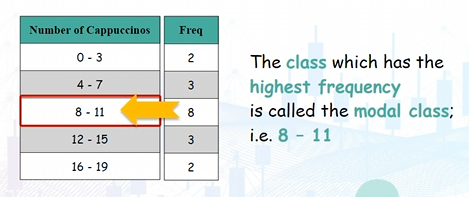  
Just identify the highest frequency class: modal class

## Distributions: spread and shape of datasets
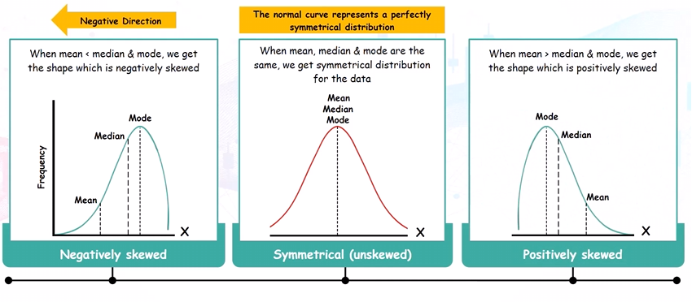
- Negatively skewed
	- mean < median&mode
- Symmetrical distribution
- Positively skewed
	- mean > median&mode

## Unimodal, Bimodal, Trimodal
Determine number of peaks  
Number of peaks $\neq$ number of modes
- Unimodal data
	- Set of numbers with 1 peak
- Bimodal data
	- 2 distinct peaks
- Trimodal
	- 3 distinct peaks

## Impact of outliers on mean
Outliers in data can highly influence the mean.
- skews the data in a certain direction
- not true of most of data entry points 

Solution:
1. remove the outlier
2. OR use the median instead of mean

# Measures of spread
- measure of location alone is insufficient to summarise a dataset

Measure of spread:
- a measure of how far data are spread out

## Range
defined as the difference between the **lowest and highest data values**

Highest value - lowest value
- Can be misleading because it is influenced by outliers
## Interquartile Range
defined as the difference between **lower quartile Q1 (25%) and upper quartile Q3 (75%)**
- the median is Q2 (50%)

IQR:  
Q3 - Q1
- gives us 50% of our data

Steps:
1. Sort data
2. Find the median (Q2)
	- For even data, the median will be in between 2 numbers
3. Split data
4. Find the median of the first group (Q1) and the median of the second group (Q3)
	- If even data, median will be in between 2 numbers
5. IQR = Q3 - Q1

### Box plot
aka box and whisker plot, five-number summary  
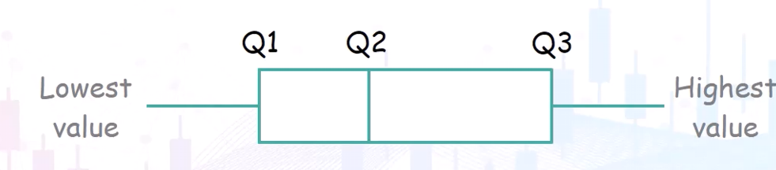  
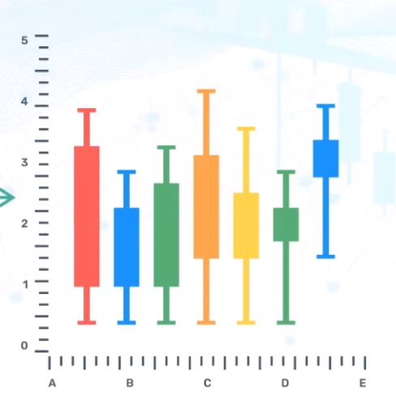
#### Plotting a box plot
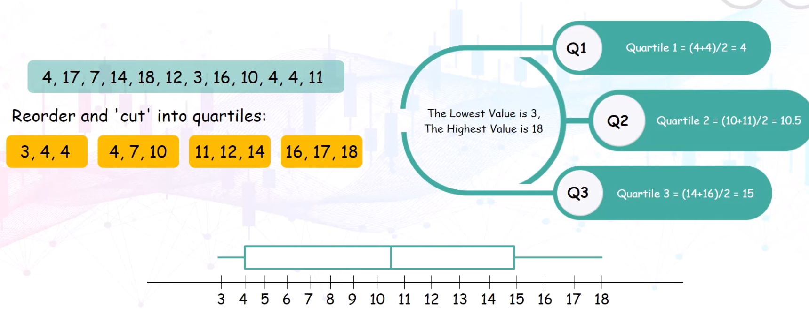
#### IQR limits in a box plot
The whisker in the box and whisker plot is not drawn beyond 1.5x IQR on both sides  
Outliers is observation falling:
- below Q1 - 1.5(IQR)
- above Q3 + 1.5(IQR)
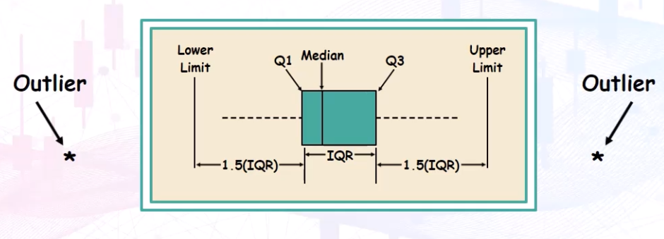

## Variance
defined as the average of ALL squared deviations ('distance') from the mean

Population Variance:

$$
\sigma^2 = \frac{\sum(x_{i}-\mu)^2}{N}
$$

Sample Variance:

$$
s^2=\frac{\sum(x_{i}-\bar{x})^2}{n-1}
$$

Note: denominator is n-1 because it is more accurate

## Standard Deviation
defined as the square root of variance

Population standard deviation:

$$
\sigma = \sqrt{ \sigma^2 }
$$

Sample standard deviation:

$$
s = \sqrt{ s^2 }
$$

## Alternative formulae for Variance and standard deviation (faster)
- does not require mean value
Population variance:

$$
\sigma^2=\frac{1}{N}\left( \sum x_{i}^2-\frac{\left( \sum x_{i} \right)^2}{N} \right)
$$

Sample variance:

$$
s^2=\frac{1}{n-1}\left( \sum x_{i}^2-\frac{\left( \sum x_{i} \right)^2}{n} \right)
$$

# Coefficient of variation
is a measure of relative variability and it is the ratio of standard deviation over mean
- used as a measure of risk

Population CV:

$$
CV = \frac{\sigma}{\mu}(\times\text{100\%})
$$

Sample CV:

$$
CV = \frac{\sigma}{\bar{x}}(\times\text{100\%})
$$

CV is useful for comparing 2 or more variables having different means and different standard deviations.
- Smaller CV: data points are closer to the mean
	- indicates **consistency and lower variability**
- Higher CV: data points have a greater degree of variation compared to mean
	- indicates **higher risk**

Example:  
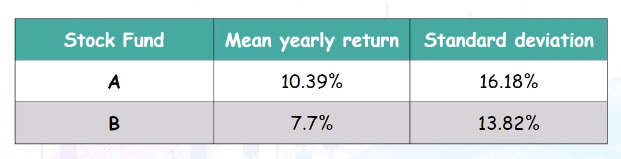  
Because both stock funds have different means, we need to compute relative variability:  
For Fund A:  

$$
CV = \frac{16.18}{10.39} = 1.557
$$

For Fund B:

$$
CV = \frac{13.82}{7.7}=1.795
$$

CV is higher = Riskier  
Fund B has higher investment risk than Fund A