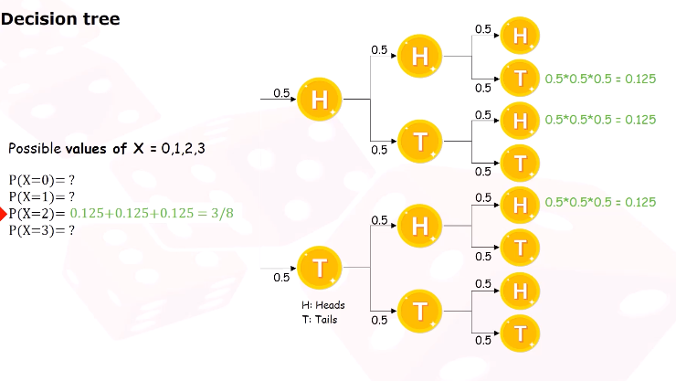
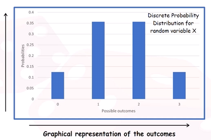
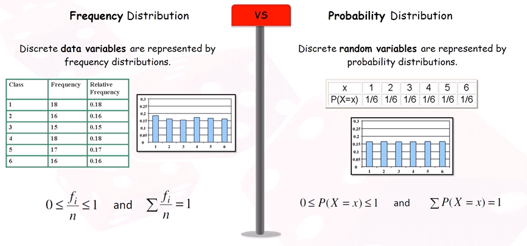
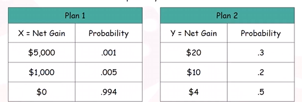
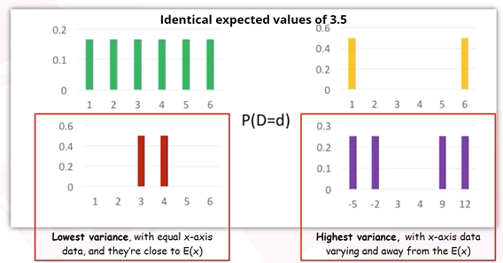

# Random Variable
- usually written as 'X'
- Possible values are numerical outcomes of a random phenomenon
To map outcomes from a random process to numbers  
Example of tossing a dice:  
Let X be the number obtained when tossing a dice

$$
\begin{gathered}
P(X=1)=\frac{1}{6}\\
P(X=2)=\frac{1}{6}
\end{gathered}
$$

Example of tossing 2 coins  
Let X be the number of heads from flipping 2 coins
- X is the random variable
- Possible Values of X is {0,1,2}
	- Caused by random events like {TT}, {HT,TH}, {HH}

## Variable vs Random Variable
Variable
- Symbol representing quantity
- no assumptions about its value
Random Variable
- value that follows a **probability distribution**
- value that is subject to some randomness or chance

## Types of random variables
X to represent random variable, x to represent small letter
1. Discrete
	- $P(X=x)$
	- take one of countable list of **distinct** values
	- find probabilities for exact outcomes
	- precise value
2. Continuous
	- $P(x_{1}\leq X\leq x_{2})$
	- take any value in an interval or collection of intervals
	- probabilities for intervals of values

## Discrete Random Variables
Example:  
Discrete:
- Z = number of babies born tomorrow in the universe
- Y = the year in which as student from this class was born
- W = exact winning time for swimming a sprint rounded to nearest tenth

NOT Discrete:  
X = exact winning time for swimming a sprint

### Probability calculation of discrete random variables
Example:  
Let X be the number of heads after 3 flips of a fair coin
- Possible outcomes
	- {HHH, HTH, HHT, HTT, TTT, THT, TTH, THH}
- Possible values of X
	- X = 0,1,2,3
		- P(X=0) = ?
		- P(X=1) = ?
		- P(X=2) = ?
		- P(X=3) = ?
- What is the probability of each value of X?
	- We can deduce probability by looking at the outcomes
	- P(X=0) = $\frac{1}{8}$
	- P(X=1) = $\frac{3}{8}$
	- P(X=2) = $\frac{3}{8}$
	- P(X=3) = $\frac{1}{8}$
	- Drawing a decision tree (alternative approach)
		- 
		- Number of outcomes = 2n where n is the number of trials/coin flips

# Probability Distribution
## Discrete Probability Distribution
Graphical representation of previous example:  
Let X be number of heads after 3 flips of a fair coin  

- Plot outcomes to probabilities
- discrete set of numbers
- not contiguous 

Probability distribution definition:  
probability distribution of a discrete random variable X is the **collection of all possible values x** with their associated probabilities
- usually shown as table, graph or formula

### Similarity to relative frequency distribution

- Both will sum to 1
- Difference:
	- Relative frequency comes from sample data
	- Probability distribution for random variables are projected and expected probabilities

## Mean/Expected Value
The expected value (mean) of a discrete random variable is calculated as:

$$
E(X)=\mu=\sum xP(X=x)
$$

Example: Let X be the number obtained when rolling a dice. The mean or expected value of X is:

$$
E(X)=1\left( \frac{1}{6} \right)+2\left( \frac{1}{6} \right)+3\left( \frac{1}{6} \right)+4\left( \frac{1}{6} \right)+5\left( \frac{1}{6} \right)+6\left( \frac{1}{6} \right)=3.5
$$

## Law of Large Numbers
Expected value is of practical importance because it has been show that as the number of trails increases, the mean will converge on the expected value.
- The more times that data is sum together, the closer the mean will be to the expected value.
- the expected value is kind of taking infinite roles of the dice, summing them together and taking the average of the mean
- Mean is based on the empirical data we have
- Expected value is the ideal probability

Example:  
$P(X=0)=0.5\times 0.3 =0.15$  
$P(X=1)=0.5 \times 0.3 + 0.5 \times 0.7 = 0.5$  
$P(X=2)=0.5 \times 0.7 =0.35$  
Calculate Expected Value:
- $E(X) =\sum (x \times P(X=x))$
- Multiply each value by its probability, then sum each value pair
- $0 \times 0.15+1\times 0.5+0.35\times 2 = 1.2$

## Measures of Spread
Variance of a discrete random variable X:

$$
Var(X) = \sigma^2 = \sum(x-\mu)^2P(X=x)
$$

Standard deviation of a discrete random variable X is:

$$
\sigma = \sqrt{ \sigma^2 }
$$

Example:
$100 to invest in 1 of 2 investment plans:  
  
Try to calculate Expected Value:
- $E(X)=\mu_{x}=(5000)(0.001)+(1000)(0.005)+(0)(0.994)=10$
- $E(Y)=\mu_{Y}=(20)(0.3)+(10)(0.2)+(4)(0.5)=10$
Expected Value seems the same so we measure spread
Variance:
- Var(X) = $0.001(5000-10)^2+0.005(1000-10)^2+0.994(0-10)^2 = 29900$
- Var(Y) = $0.3(20-10)^2+0.2(10-10)^2+0.5(4-10)^2 = 48$
Standard Deviation:
- $\sigma_{X}=\sqrt{ 29900 }=\$172.92$
- $\sigma_{Y}=\sqrt{ 48 }=\$6.93$
Coefficient of variance:
- $CV_{X}=\frac{\sigma_{X}}{\mu_{X}}=\frac{172.92}{10}=17.29$
- $CV_{Y}=\frac{\sigma_{Y}}{\mu_{Y}}=\frac{6.93}{10}=0.69$
Most likely invest in Plan 2 with lower risk

Example:  
Which of these graphs shows the lowest and highest variance of data?  

# Binomial Random Variable
A type of random variable used for a random phenomenon.  
The random phenomenon must exhibits these features:
1. 1 of 2 discrete outcomes categorised as **success or failure**
	- A coin flip can be categorised as Heads for success and Tails for failure.
	- Only 2 outcomes
2. **Probability of success and failure** that is fixed over all trials.
	- Success and failure remains same for each trial, in the context of a coin flip.
3. There should be a **fixed number of independent trails**
	- For a coin flip, we will always have a fixed number of coin flips/trails and each trial is independent of each other.
Basically
- Only 2 outcomes
- Each outcome will need to have constant probability
- Fixed number of trials (Must be known and stay at that)
- Independent trials (Selecting 1 cannot affect the probabilities of others)

Example:  
Consider X = number of heads I get after flipping a coin 10 times
- Check whether X is a binomial variable
	- Each head is a success (only heads or tails for outcomes)
	- Each trial is identical to the previous (Independent)
	- Probability of each is trial is the same (constant probability)
	- 10 times (known fixed number of trials)

# Binomial Distribution
Probability distribution of a binomial random variable X is written as:

$$
X \sim B (n,p)
$$

where n = number of trials & p = probability of success

Binomial Formula:

$$
\begin{gathered}
P(X=x)=\binom nx p^x(1-p)^{n-x}\\
\text{where }x=\text{number of success}\\
\text{where }n=\text{number of trials}\\
\text{where }p=\text{probability of success}\\
\color{white} \rule{9cm}{0.4pt}\\
\text{where }\binom nx = C^n_{x}=\frac{n!}{(n-x)!x!}
\end{gathered}
$$

Mean:

$$
E(X)=np
$$

Variance:

$$
Var(X)=np(1-p)
$$

Mean and Variance formulas can only be used for a binomial variable

Example:  
Variable X being the number of heads obtained when a fair coin is tossed 3 times.
- Find the mean and variance
	- We can identify that the X is a binomial random variable
		- n = 3 identical trials
		- 2 possible outcomes - heads or tails
		- P('success') = 0.5
		- Every trial is independent
	- Mean: $E(X)=np=3\times 0.5=1.5$
	- Variance: $Var(X)=np(1-p)=1.5\times(1-0.5)=0.75$

Example:  
Same previous example
- Find the probability when the number of heads is exactly 1, 2, or 3? $X\sim B(3,0.5)$
	- $P(X=1)=3C1\times 0.5^1\times(1-0.5)^{3-1}=0.375$
	- $P(X=2)=3C2\times 0.5^2\times(1-0.5)^{3-2}=0.375$
	- $P(X=3)=0.125$

Example:
A quality control system selects a sample of 10 items from each batch of products for testing. If 2 or more of the sample are defective, the whole batch is rejected.
- If the probability of an item being defective is 0.05, what is the probability of having 2 defects in the sample?
	- Binomial Variable $X\sim B(10,0.05)$
		- Fixed 10 trials
		- Success: 0.05, independent, constant
		- 2 outcomes
	- x = 2, n = 10, p = 0.05
	- $P(X=2)=10C2\times 0.05^2\times(1-0.05)^{8}=0.0746$
- If the probability of an item being defective is 0.05, what is the probability that a batch is rejected?
	- Rejected = 2 or more = $X=2\text{ or }X=3\text{ or }\dots\text{ or }X=10$
	- P(reject) = 1 - P(accept) = P($X\geq 2$)
	- P(accept) = $P(X=1)+P(X=0)$
		- We can only afford to have 0 or 1 defective items
		- x =0, n= 10, p=0.05
		- $P(X=0)=10C0\times 0.05^0\times(1-0.05)^{10}=0.5987$
		- $P(X=1)=10C1\times 0.05^1\times(1-0.05)^9=0.3151$
		- P(accept) = 0.9138
		- P(reject) = 1-0.9138 = 0.0862
- What is the mean number of defects in a batch?
  What is the standard deviation of number of defects in a batch?
	- n =10, p=0.05 for defects
	- Mean E(X) = 0.5
	- Variance = $0.5 \times(1-0.05)$ = 0.475
	- SD = 0.6892