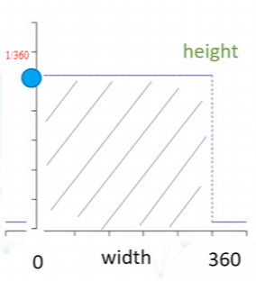
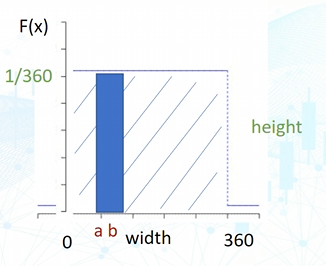
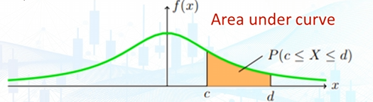
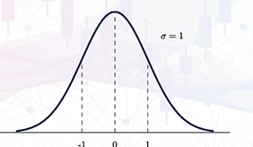
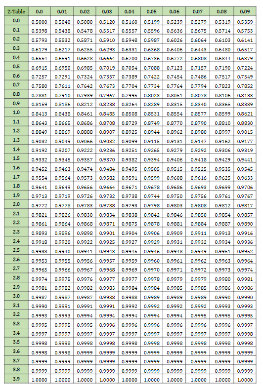
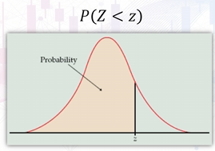
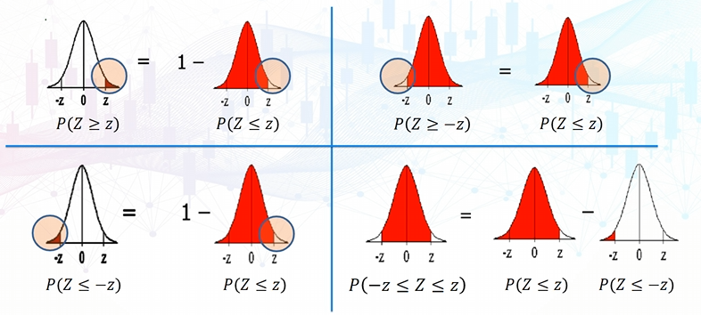
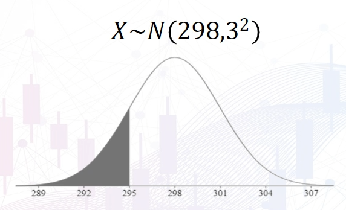

# Precise Probability in a continuous space
For a continuous random variable X:
- the probability of a point would be 0
	- because there are infinite precisions
	- very unlikely to get a precise value with the exact decimals
But we can calculate the probability of a range of values

Example:  
An arrow spinning in a circle of $360\degree$  
What is the probability of the arrow stopping between 0 and 180 degrees?
- $P(0\le x\le 180)$?
	- $\frac{180-0}{360}=0.5$
How about between 260 and 290 degrees?
- $\frac{290-260}{360}=\frac{1}{12}$

Formula for probability, when all possibilities are likely:

$$
\frac{\text{Size of requested interval}}{\text{Size of the whole interval}}
$$

Plotting a probability density function against random variable values of equal probabilities:  

- Probability: Area under curve
- Width: Number of options
- Total probability: Whole area = height $\times$ width = $\frac{1}{360}\times 360$ = 1

# Probability Density Function
Density is the probability for a continuous random value

For a **uniform distribution**, the height is the probability.
- 
- f(x) = 1/360-0 = 1/360
- For any interval where $a\le x\le b$, the probability is the area under the curve
	- Probability = $(b-a)\times\text{height}$

Formal definition:  
The PDF of a continuous random variable X is a function f(x) such that the area under the curve over an interval = the probability of X in that interval  

For a curve that is not a uniform distribution, the probability formula is:

$$
P(c\leq x\leq d)=\int_{c}^df(x)dx
$$

The probability for a specific outcome will still be 0:  
$\int^x_{x}f(x)dx=0$
- it also means its negligible
Therefore, we can still find the probability for an interval of values(outcomes) to occur:  
$P(a<X<b)=P(a\leq X<b)=P(a<X\leq b)=P(a\leq X\leq b)=\int^b_{a}f(x)dx$
- we are not concerned with the inequality symbols because A or B precisely occurring, the probability is zero

Mean & Variance:

$$
\begin{gathered}
E(X)=\mu=\int_{-\infty}^{\infty} xf(x) \, dx \\
Var(X)=\sigma^2=\int_{-\infty}^{\infty} (x-\mu)^2f(x) \, dx 
\end{gathered}
$$

# Uniform Distribution
or a rectangle distribution has all intervals of the same length on the distribution's support are equally probable
- The function is defined by 2 parameters, a and b, which are its minimum and maximum values of the required interval

# Normal Distribution
A normal random variable or normal distribution X, written as $X\sim N(\mu,\sigma^2)$
- bell curve shape
- different values of mean and stddev represent different normal distributions
PDF = $\int_{c}^df(x)dx$
- $f(x)=\frac{1}{\sigma \sqrt{ 2\pi }}e^{-\frac{1}{2}(\frac{x-\mu}{\sigma})^2} ~~-\infty<x<\infty$

## Standard normal probability distribution
- Problem: difficult to calculate probabilities of a normal distribution directly.
	- All normal distributions however, can be transformed into a **standard normal**

Definition:  
A standard normal written as $Z\sim N(0,1)$
- Has a mean of 0 and a variance of 1
- PDF: $f(x)=\frac{1}{\sqrt{ 2\pi }}e^{-\frac{1}{2}x^{2}}~~~-\infty<x<\infty$
- 

### Conversion from normal X to standard normal Z
$$
Z=\frac{X-\mu}{\sigma}
$$

## Z-Table
a table of precomputed probabilities  

- In the Z-table, we are given the **probabilities of anything of the Z line**
- Big Z represents the range of values possible
	- Small z represents the x axis value

Example:  
Using the Z-table, find $P(Z\leq 1.36)$
- Look to the left column to find 1.3 row
- And match to correct column of 0.06
- $P(Z\leq 1.36)=0.9131$

Example:  
$P(Z\leq 1.345)?$
- In between 0.9099 and 0.9115
	- $\frac{0.9115 + 0.9099}{2}=0.9107$

Example:
- $P(Z>1.11)= 1-P(Z\leq 1.11)=1-0.8665=0.1335$

### Symmetry property of Z-table
The Z-table is symmetrical around the mean  
Most Z-tables **only tabulate** $P(Z<z)$  
  
$Z\geq z$ is the smaller area  
-z is the mirrored z on the left
- $P(Z\geq z)=P(Z\leq-z)$
- $P(Z\leq z)=P(Z\geq-z)$

Example:  
What is the value of z if P(Z<z) = 0.95?
- Lookup the table
- 1.645

Example: A machine fills bottles with 300ml of soft drink. However, the actual quantity filled varies according to the normal distribution with $\mu=298ml$ and $\sigma=3ml$. What is the probability that an individual bottle contains less than 295ml?
- $X\sim N(298, 3^2)$, we have to find P(X < 295)
	- Normal distribution graph:
	- 
- Our x is 295, we have to find the corresponding z value on the standard normal
	- $Z=\frac{X-\mu}{\sigma}=\frac{295-298}{3}=-1$
- Find P(Z < -1)
	- Table says P(Z < 1) = 0.8413
	- P(Z < -1) = 1 - 0.8413 = 0.1587

