# Determining uncertainty with probability
Inferential statistics: infer the random phenomenon with the help of probability distribution model
- obtain **sample** statistics to make inferences about population parameters
	- not practical or impossible to get data for all of population
- 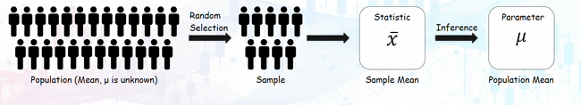
- Inferential statistics is about randomly selecting a representative sample to obtain sample statistic. For example, calculate mean $\bar{x}$, to infer the unknown $\mu$.

# Process of statistical studies
1. Curiosity about something
2. Ask questions about a parameter
3. Collect data appropriate for that parameter
4. Make inferences about that value of the parameter

## Statistical questions
to answer these questions. need to collect data with **variability**
- <font color="#00b0f0">Variability is the degree to which data points vary</font>

Example:
- Which of these are a statistical question?
- [ ] Am I sleepy?
- [x] How much time do my friends spend sleeping, on average, in a year?
- [ ] How many students are attending today's lecture
```
3rd option: has a fixed value
```
Example:
- [x] How heavy are elephants?
- [ ] How old are you?
- [x] How old, on average, are the students who took the CSC1006 class this year?
- [x] Do wolves weigh more than dogs?
- [ ] Is your cat heavier than that dog?
- [ ] How many teeth are in your dog's mouth?
- [x] Do university students gain weight during their first year?
```
- Statistical questions often inquire about characteristics or behaviours of groups, averages or comparisons between groups
- Acknowledge variability in data
NOT Individual Focus
NOT Fixed Responses
```

## Study design
Consider how to design a study to answer the statistical question

Example:  
Curiosity: Do university students gain weight during their first year?  
Options: 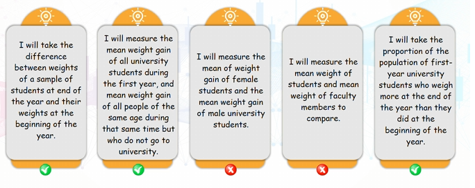
- focus on university Students weight, comparing between time difference or class difference

### Considerations
Formulate a question into 1 of these 3 questions about population parameters:  
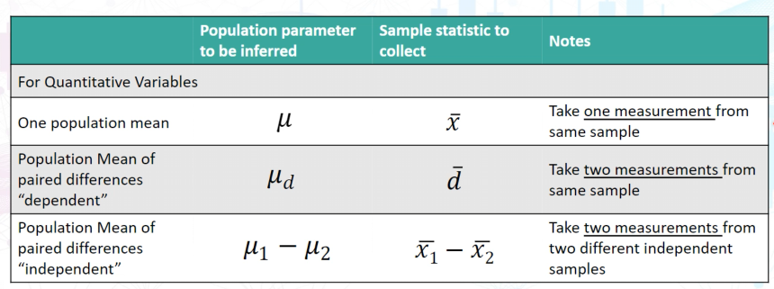

Example:  
Curiosity: Do university students gain weight during their first year?  
2 ways:
1. Parameter $\mu_{d}$
	- Mean weight gain difference between weight at end of year and weight at beginning of the year during the first year for the population of university students
		- We take 2 measurements from the same sample
		- Population Mean of paired differences "dependent"
2. Parameter $\mu_{1}-\mu_{2}$
	- Where $\mu_{1}$ = mean weight gain of all university students during the first year, and $\mu_{2}$=mean weight gain of all people of the same age during that same time but who do not go to university
		- We take 2 measurements from 2 different independent samples

# Type of Statistical Studies
In Study Design, we see if there are comparison groups:
- There are comparison groups
	- **Analytic**
		- Quantify relationship between factors
		- Will the groups be randomly allocated?
			- Yes
				- **Experimental Study**
			- No
				- **Observational Study**
- No
	- **Descriptive Study / Survey**

## Controlled experiment
- participants are randomly assigned to participate in a specific treatment or a control group without treatment
- try to setup something valid to compare with (a solid reference) called a **control group**, where all lurking and cofounding variables or factors that might affect the results are controlled.
	- <font color="#00b0f0">lurking</font> variables are **unforeseen third variables that affect observational** studies
	- <font color="#00b0f0">confounding</font> variables are those that **affect the response variable** and are related to the explanatory/independent variable
- establish <font color="#00b0f0">**causation**</font>
	- show that the intervention(treatment) **caused a certain result** compared with the control group
	- must control and account for confounding and lurking variables

Example (how a study is controlled):  
A controlled experiment about meditation  
There are 48 volunteers
- random assignment to groups
	- Treatment group
		- 24 participants learn meditation
	- Control group
		- 24 participants don't meditate
- exam grades are compared

## Observational study
researchers only **measure or observe the participants** and do not assign any treatments or conditions.
- they look for relations between variables
- establishes <font color="#00b0f0">**correlation**</font>
	- we do not know what causes the effect because there might be confounding or lurking variables

Example:
Can drinking coffee help you live longer?
- 400,000 men and women ages 50 to 70
	- Survey coffee drinking and divide them into 2 groups\
		- Group 1
			- Frequent coffee intake
			- measure ages upon death
		- Group 2
			- Infrequent or no coffee intake
			- measure ages upon death
	- Ages upon death are compared

# Correlation vs Causation
- Correlation does not imply Causation
- Correlation only means that the 2 events co-exist more often than ordinary chance. They are changing together somehow
	- A lurking third or more variables might connect both together

Therefore, cause-and-effect relationships usually cannot be inferred from observational studies.

Example:   
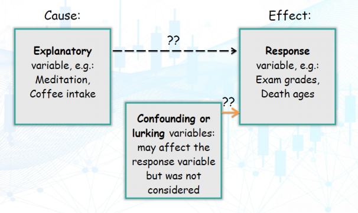
- Explanatory Variable 
	- where variables are the causes
- Response Variable
	- where variables show the effects
- Confounding or lurking variables
	- not considered
	- may affect response variable

Many relationships are complex
- unlikely for an explanatory variable to be the direct and sole cause for the results of the response variable
- need control groups and randomise experiments
	- to account for confounding/lurking variables
	- due to random assignment of participants which should approximately even out the influence the 2 groups

# Sampling Methods: Probability Sampling
Need to get sample that are:
- Have good variability
- good data quality
- size

## Picking a reasonable sample
Example:  
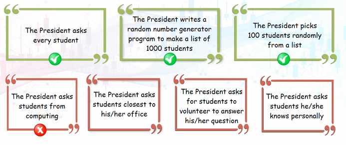

Methods:
1. Probability (<font color="#00b050">Should be used to get a reasonable reflection of the population data</font>)
	- Simple Random Sampling
	- Systematic Sampling
	- Cluster Sampling
	- Stratified Sampling
2. Nonprobability (<font color="#ff0000">implicit bias</font>)
	- Convenience Sampling
	- Self-selected Sampling

Non-probability sampling methods are haphazard
- don't ensure every member of the population has an equal chance of being selected

## Simple Random Sampling
- use **random numbers** to ensure every member of the population has <font color="#00b0f0">equal chance</font> of being selected
- a randomised process
- 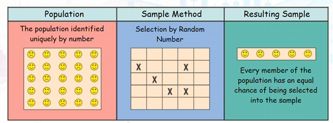

## Systematic Sampling
- members are placed in a certain order
	- then, select a **random starting point** for the first sample member
		- then, **skip a constant interval** to select other members
- 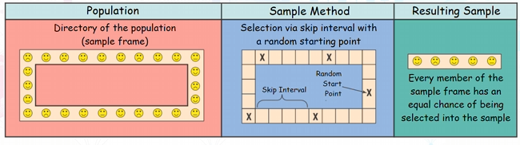

## Cluster Sampling
- population is **divided into clusters** which are similar to other clusters
	- **cluster members** is then randomly selected from 1 or more **randomly selected clusters**
	- 2 randomisation process
- 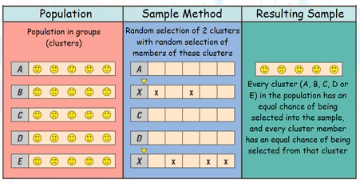

## Stratified Sampling
- Population **divided into different strata** (distinct subgroups within a larger population)
	- Then, use **simple random sampling** to take samples from each stratum
- 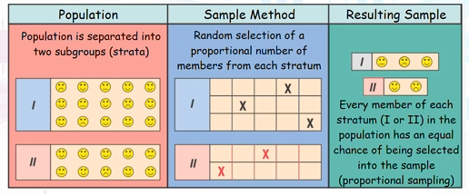
- Key: From each stratum, randomly <font color="#00b0f0">select a proportional number of members</font>
	- **Proportional** to the total population
	- 3 of 5 from first stratum
	- 2 of 5 from second stratum
- Side effect: <font color="#00b0f0">Isolates some variables</font>
	- decide where to draw the line between each stratum

## Convenience Sampling
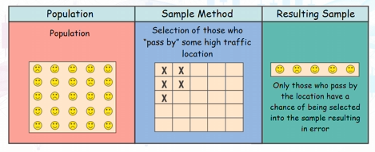

## Self-selected Sampling
- Relying on **self-selected voluntarily responses** that are sure to be biased in favour of those with strong opinions
- 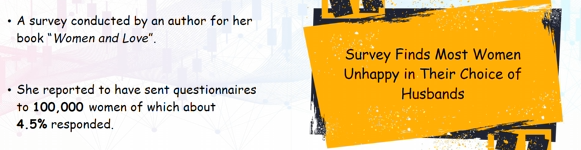

# Sampling Distribution
Sampling distribution is a probability distribution
- it has expected value and variance too
- <font color="#00b0f0">sampling and probability distribution have the same expected value (mean)</font>
	- 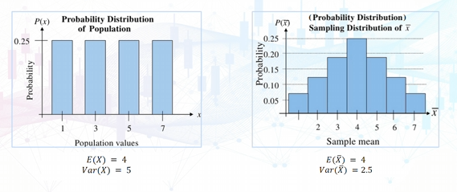

Example:  
Consider the same population of 4 numbers: 1,3,5 and 7. If a random sample size `n = 2` is selected with replacement, find sample means.
- `n=2` 2 numbers from our population
	- All possible combinations
		- 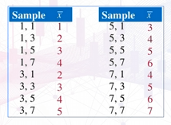
	- We can let a random variable be the sample statistic
		- in this case, the sample mean
	- Then we construct a distribution of each sample statistic (sample mean) called sampling distribution
		- 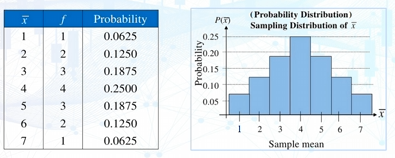
		- $\bar{x}$ is the mean value, $f$ is the frequency of each mean
		- Plot it in a distribution graph
		- We have a probability distribution of sampling distribution of the mean of the samples
	- We can calculate the mean and variance of the sampling distribution
		- 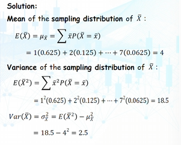

# Central Limit Theorem
- Observing Various Distributions:
	- 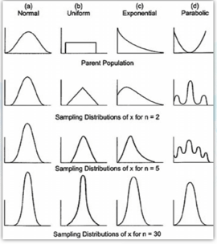
	- as sample size gets larger, **the distribution of sample means** approaches **normal distribution** regardless of the distribution of the parent population

- if sample size *n* is sufficiently large enough, the sampling distribution of the sample mean is approximately normally distributed 
	- with mean $\mu$ and standard deviation $\sigma_{\bar{x}}$ = $\frac{\sigma}{\sqrt n}$, where $\sigma$ is the standard deviation of the population
	- typically sample size $n \ge 30$ 

Example:  
A cola filling machine is supposed to fill cans with 12oz of cola. Suppose that the fills are known to have a mean of 12.1 oz and a standard deviation of 0.2oz. What is the probability that the sample mean for a 36-pack of cola is less than 12oz?
- Since n=36, Central Limit Theorem tells us that the sampling distribution is approximately normally distributed
- $\bar{X}\sim N\left( 12.1,\frac{0.2}{\sqrt{ 36 }} \right)$, use $Z=\frac{X-\mu}{s}$ to convert X value to Z value
	- $\frac{12-12.1}{\frac{0.2}{\sqrt{ 36 }}}=-3$
- $P(\bar{X}<12)=P(Z<-3)=1-P(Z<3)=1-0.9987=0.0013$

