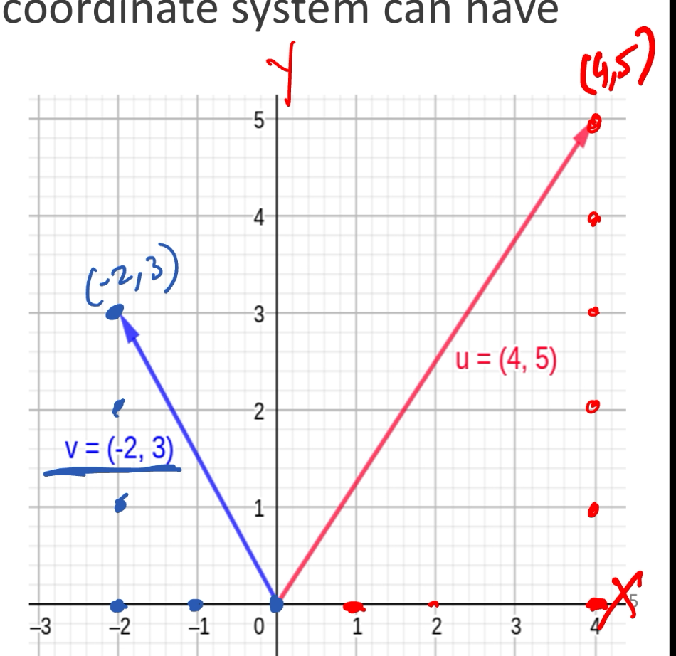
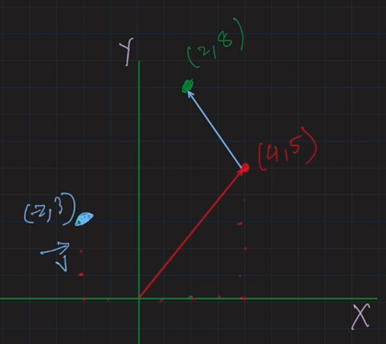
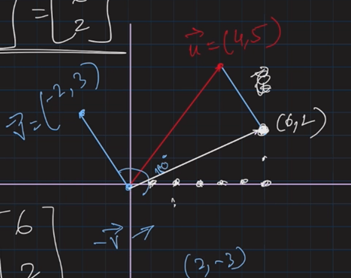
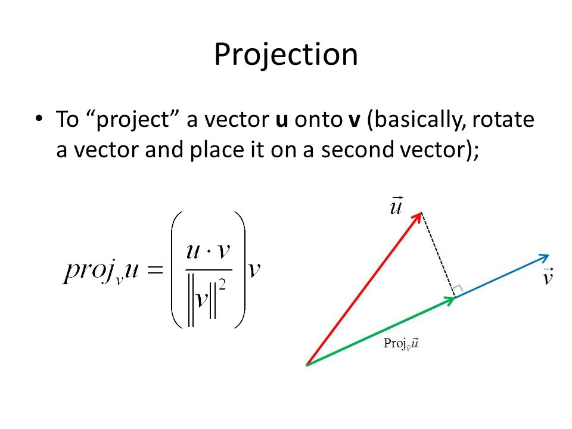
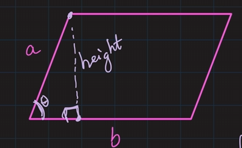
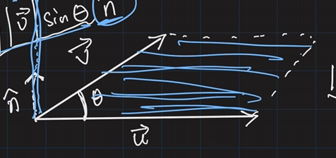
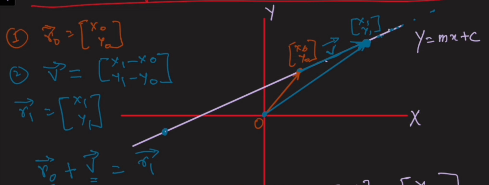
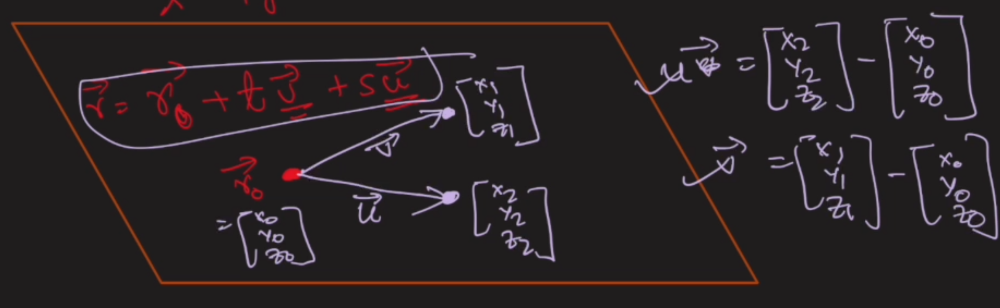
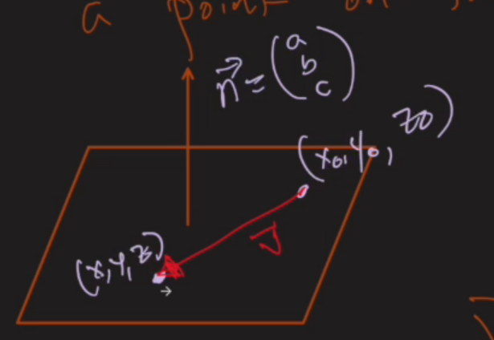

# Vector
A vector is defined as an entity with a **magnitude** and a **direction**

Example:
- Pushing force of 220 Newtons at an angle of 30deg from the horizontal
- Gravitational acceleration of 9.81 m/s^2 toward the centre of the earth

In a coordinate system, can have 3 notations:  
Matrix notation (**column vector**):

$$
\begin{gathered}
\vec{v}=\begin{bmatrix}
-2 \\
3
\end{bmatrix}
\end{gathered}
$$

**Unit vector** notation:

$$
\vec{v}=-\hat{2i}+\hat{3j}
$$

$\hat{i}\text{ is the unit vector in the x direction}$
- $\hat{i}$ has a magnitude of 1 (default property of a unit vector)
$\hat{j}\text{ is the unit vector in the y direction}$
- $\hat{j}$ has a magnitude of 1 (default property of a unit vector)

**Ordered set** notation:

$$
\begin{gathered}
\vec{v}=(-2,3)\\
\vec{u}=(4,5)
\end{gathered}
$$

To draw vector:

- Start from the origin
- Draw till the coordinate in the ordered set notation 

# Vector operations
## Magnitude & direction of a vector
```embed
title: "How to Find Direction of a Vector: Formula, Examples, & Tips"
image: "https://www.wikihow.com/images/2/2d/Find-Direction-of-a-Vector-Step-18.jpg"
description: " Quickly get the angle and magnitude of a vector  Finding the direction of a vector in a 2-dimensional plane is easy! You'll just need a little trigonometry. The x and y components of a vector form a right triangle. You can use the tangent..."
url: "https://www.wikihow.com/Find-Direction-of-a-Vector"
favicon: ""
aspectRatio: "75.0148839055368"
```

Example:  
Given a vector of $\vec{v}=(2,3)$
- The magnitude of the vector is $|\vec{v}|$
	- Calculation using Pythagorean Theorem
	- $|\vec{v}|=\sqrt{ 2^{2}+3^{2} }=\sqrt{ 13 }$
- The direction of the vector is $\theta$
	- Calculation using $\tan^{-1} \left( \frac{v_{y}}{v_{x}} \right)$, assuming vector's tail is located at origin 0,0
	- $\tan \theta=\frac{3}{2}$
	- $\theta=\tan^{-1}\left( \frac{3}{2} \right)$
Given a vector of $\vec{v}=(-2,3)$
- The magnitude is $\sqrt{ 13 }$
- The direction is 
	- $\theta=\tan^{-1}\left( \frac{3}{-2} \right)$ +180 degrees
		- because its in 2nd quadrant
	- or $\theta=180-\tan^{-1}\left( \frac{3}{2} \right)$

### Magnitude & Direction in 3 Dimensions
Magnitude:

$$
|\vec{v}|=\sqrt{ v^{2}_{x}+v^{2}_{y}+v^{2}_{z} }
$$

Direction:

$$
\theta=\tan^{-1} \left( \frac{Z}{\sqrt{ x^{2}+y^{2} }} \right)
$$


Example:  
Given a 3D vector of (1,2,3):
- Magnitude is
	- $|\vec{v}|=\sqrt{ 1^{2}+2^{2}+3^{2} }=\sqrt{ 14 }$
- Direction is
	- $\theta=\tan^{-1}\left( \frac{3}{\sqrt{ 1^{2}+2^{2} }} \right)=\tan^{-1}\left( \frac{3}{\sqrt{ 5 }} \right)$

# Scaling a vector
$$
\begin{gathered}
\lambda \vec{v}=\lambda \begin{bmatrix}V_{x} \\ V_{y} \\ V_{z}\end{bmatrix}=\begin{bmatrix}\lambda V_{x} \\ \lambda V_{y} \\ \lambda V_{z}\end{bmatrix}\\
|\lambda|>1\text{ will lengthen the vector}\\
|\lambda|<1\text{ will shorten the vector}\\
\lambda<0\text{ will flip the vector by 180}\degree 
\end{gathered}
$$

Example:  
Multiply 2 to a vector of (4,2)/$\begin{bmatrix}4 \\ 2\end{bmatrix}$
- $2\begin{bmatrix}4 \\ 2\end{bmatrix}=\begin{bmatrix}8 \\ 4\end{bmatrix}$
Half a vector of (4,2)
- $\frac{1}{2}\begin{bmatrix}4 \\ 2\end{bmatrix}=\begin{bmatrix}2 \\ 1\end{bmatrix}$
Scale a vector by -0.5
- $-\frac{1}{2}\begin{bmatrix}4 \\ 2\end{bmatrix}=\begin{bmatrix}-2 \\ -1\end{bmatrix}$
- Any negative rotates the original vector by $180\degree$

## Vector addition & subtraction
Addition:

$$
\begin{gathered}
\vec{u}=\begin{bmatrix}
u_{x} \\
u_{y}
\end{bmatrix}
\\
\vec{v}=\begin{bmatrix}
v_{x} \\
v_{y}
\end{bmatrix}\\
\vec{u}+\vec{v}=\begin{bmatrix}
u_{x}+v_{x} \\
u_{y}+v_{y}
\end{bmatrix}\\
\vec{v}-\vec{u}=\begin{bmatrix}
v_{x}-u_{x} \\
v_{y}-u_{y}
\end{bmatrix}
\end{gathered}
$$


Example:  
$\vec{u}=(4,5)~~~\vec{v}=(-2,3)$  
Addition into a new vector $\vec{w}=\vec{u}+\vec{v}=\begin{bmatrix}2 \\ 8\end{bmatrix}$
- 
Subtraction into a new vector $\vec{a}=\vec{u}-\vec{v}=\vec{u}+(-\vec{v})=\begin{bmatrix}6 \\ 2\end{bmatrix}$
- 


# Unit & Basis Vectors
## Unit vectors
Unit vectors always have a magnitude of 1  
Common 2D Unit vectors:

$$
\begin{gathered}
\hat{i}\\
\hat{j}\\
\hat{u}=\begin{bmatrix}
\frac{1}{\sqrt{ 2 }} \\
\frac{1}{\sqrt{ 2 }}
\end{bmatrix}~~~\text{is 45}\degree \text{ on positive x and y axis}
\end{gathered}
$$


Get the unit vector of any vector by<font color="#00b0f0"> dividing the vector by the magnitude</font>:

$$
\hat{u}=\frac{\vec{u}}{||u||}
$$

Example:  
Vector (3,4)
- Magnitude = 5
- unit vector: $\begin{bmatrix}3\div 5 \\ 4\div 5\end{bmatrix}$

## Basis vectors
are fundamental vectors in a vector space that <font color="#00b0f0">define the space's orientation and structure</font>
- 2D and 3D are operated with standard basis vectors (in Cartesian coordinates)

Basis Vectors in 2D
- typically represented as
	- $v=v_{x}\hat{i}+v_{y}\hat{j}=\begin{bmatrix}v_{x} \\ v_{y}\end{bmatrix}$
	- Example: (5,4)
		- $5\hat{i}+4\hat{j}$

Basis Vectors in 3D  
$\hat{i},\hat{j},\hat{k}$ or $\vec{e_{1}},\vec{e_{2}},\vec{e_{3}}$

$$
\begin{gathered}
\hat{i}=\begin{bmatrix}
1 \\
0 \\
0
\end{bmatrix},~\hat{j}=\begin{bmatrix}
0 \\
1 \\
0
\end{bmatrix}, \hat{k}=\begin{bmatrix}
0 \\
0 \\
1
\end{bmatrix}
\end{gathered}
$$

typically represented as

$$
v=v_{x}\hat{i}+v_{y}\hat{j}+v_{z}\hat{k}=\begin{bmatrix}
v_{x} \\
v_{y} \\
v_{z}
\end{bmatrix}
$$


### N-Dimensions standard basis vectors
N-Dimensions vectors:  
$\vec{e_{1}},\vec{e_{2}},\dots,\vec{e_{n}}$  
N-Dimensions vectors (column notation):  
$\vec{e_{1}}=\begin{bmatrix}1 \\ 0 \\ 0 \\ \vdots \\ 0\end{bmatrix}, \vec{e_{2}}=\begin{bmatrix}0 \\ 1 \\ 0 \\ \vdots \\ 0\end{bmatrix},\dots,\vec{e_{n}}=\begin{bmatrix}0 \\ 0 \\ \vdots \\ 1\end{bmatrix}$

## Non-standard basis vectors in 2D
Non-standard basis vectors are vectors that are not $\vec{v_{1}}=\begin{bmatrix}1 \\ 0\end{bmatrix}$ and $\vec{v_{2}}=\begin{bmatrix}0 \\ 1\end{bmatrix}$  
For any coordinate in 2D:  
$\begin{bmatrix}a \\ b\end{bmatrix}=\alpha \times \vec{v_{1}}+\beta \times \vec{v_{2}}$
- vector in 2D space represented as a linear combination of 2 other vectors
- <font color="#00b0f0">only for vectors non parallel and non zero</font>

Example of non-standard basis vectors:  
$\vec{v_{1}}=\begin{bmatrix}1 \\ 1\end{bmatrix}$ & $\vec{v_{2}}=\begin{bmatrix}-1 \\ 1 \end{bmatrix}$
- To reach vector (0,2)
	- $\vec{v_{1}}+\vec{v_{2}}=\begin{bmatrix}0 \\ 2\end{bmatrix}$
- Any Vector (a, b)
	- represented as $\alpha \begin{bmatrix}1 \\ 1 \end{bmatrix}+\beta \begin{bmatrix}-1 \\ 1\end{bmatrix} = \begin{bmatrix}\alpha \\ \alpha\end{bmatrix}+\begin{bmatrix}-\beta \\ \beta\end{bmatrix}=\begin{bmatrix}\alpha-\beta \\ \alpha+\beta\end{bmatrix}$
	- a = $\alpha-\beta$, $b=\alpha+\beta$
	- Rearrange: 
		- $\alpha=\frac{a+b}{2}$
		- $\beta=\frac{b-a}{2}$
	- Vector (a,b) = $\left( \frac{a+b}{2} \right)\vec{u_{1}}+\frac{b-a}{2}\vec{u_{2}}$

## Linear Independence
```embed
title: "Introduction to linear independence | Vectors and spaces | Linear Algebra | Khan Academy"
image: "https://i.ytimg.com/vi/CrV1xCWdY-g/maxresdefault.jpg"
description: "https://www.khanacademy.org/math/linear-algebra/vectors-and-spac..."
url: "https://www.youtube.com/watch?v=CrV1xCWdY-g"
favicon: ""
aspectRatio: "56.25"
```
Vectors that are non-parallel with each other are linearly independent with one another
- Basis vectors are linearly independent
	- The span of the vector space (of all vectors) can be generated from a set of vectors through linear combinations
- To<font color="#00b0f0"> check if vectors are linearly independent</font> in an <font color="#00b0f0">N Dimension</font> space:
	- $0=C_{1}=C_{2}=\dots=Cn\iff C_{1}\vec{u_{1}}+C_{2}\vec{u_{2}}+\dots+C_{n}\vec{u_{n}}=0$
	- Opposite property
		- If there is a solution where $C_{1}\vec{u_{1}}+C_{2}\vec{u_{2}}+\dots+C_{n}\vec{u_{n}}=0$, and the solution is $0\neq C_{1}=C_{2}=\dots=Cn$, the vectors are linearly **dependent**.

# Vector Products
## Dot Product
### Projection of vector onto another

- Consider 2 vectors
- The projection of $\vec{u}$ onto $\vec{v}$ is to 'draw' a perpendicular line to $\vec{v}$ and the projection is the new vector $Proj_{\vec{v}}\vec{u}$ (or can be denoted as $Proj_{v}u$ or $P$)
- The magnitude of this projection vector is $|P|=|\vec{u}|\cos \theta$
	- because CAH is $\cos \theta=\frac{\text{adjacent}}{\text{hypotenuse}}$
		- $\text{adjacent}=\cos \theta \times\text{hypotenuse}$

### The use of DOT product
- **Geometric Definition**: Dot product of $\vec{v}$ and $\vec{u}$ can be represented as $\vec{v}\cdot \vec{u}=|\vec{v}||\vec{u}|\cos \theta$
	- can be seen as $|Proj_{v}u|\times |\vec{v}|$ or $|Proj_{u}v|\times |\vec{u}|$
- **Algebraic Definition**: Dot product of $\vec{v}$ and $\vec{u}$ is
	- $\begin{bmatrix}u_{1} \\ u_{2} \\ \vdots \\ u_{n}\end{bmatrix}\cdot \begin{bmatrix}v_{1} \\ v_{2} \\ \vdots  \\ v_{n}\end{bmatrix}=\vec{u}\cdot \vec{v}=u_{1}v_{1}+u_{2}v_{2}+\dots+u_{n}v_{n}$
- Therefore, we can rewrite and get a formula to calculate the angle between 2 vectors:

$$
\cos \theta=\frac{u_{1}v_{1}+u_{2}v_{2}+\dots+u_{n}v_{n}}{|\vec{v}|\times |\vec{u}|}
$$


Example:  
What is the angle between $\vec{u}=(2,3)$ and $\vec{v}=(5,6)$
- $\vec{u}\cdot \vec{v}=u_{1}v_{1}+u_{2}v_{2}=5\times 2+6\times 3=28$
- $|\vec{v}|\times |\vec{u}|=\sqrt{ 2^{2}+3^{2} }\times \sqrt{ 5^{2}+6^{2} }=\sqrt{ 793 }$
- $\cos \theta=\frac{28}{\sqrt{ 793 }}$
- $\theta=\arccos\left( \frac{28}{\sqrt{ 793 }} \right)\approx 6.12\degree$

### Properties of dot product
1. Commutative property
	- $\vec{b}\cdot \vec{a}=\vec{a}\cdot \vec{b}$
2. Distributive property
	- $\vec{a}\cdot(\vec{b}+\vec{c})=\vec{a}\cdot \vec{b}+\vec{a}\cdot \vec{c}$
3. Associative Property with Scalars
	- $(k\vec{a})\cdot \vec{b}=(k\vec{b})\cdot\vec{a}=k(\vec{a}\cdot \vec{b})$
4. Magnitude Relation
	- $\vec{a}\cdot \vec{a}=||\vec{a}||^{2}$
5. Zero Vector Property
	- $\vec{u}\cdot \vec{0}=0$

## Cross Product
### CROSS Product: Parallelogram
Area of a parallelogram = length $\times$ height  

- If given 2 sides a and b, area can be represented as $ab\sin \theta$


- $\vec{u}$ & $\vec{v}$ are 3 dimensional vectors
- $\vec{u}\times \vec{v}=|\vec{u}||\vec{v}|\sin \theta \hat{n}$
	- Cross Product results in a vector
	- need to multiply with $\hat{n}$ (normal vector)
		- Unit vector $\hat{n}$ represents direction of the resultant vector and is a unit vector (magnitude of 1)
			- $\hat{n}$ is the normal (perpendicular direction) of the parallelogram in a 3D space
		- specifically **defined as being orthogonal (perpendicular)** to both $\vec{u}$ and $\vec{v}$
- $||\vec{u}\times \vec{v}||=|\vec{u}||\vec{v}|\sin \theta$
	- Magnitude of cross product (scalar)
	- Equal to the area of the parallelogram

### Algebraic Interpretation of cross product
$$
\begin{gathered}
\vec{a}=\begin{bmatrix}
a_{1} \\
a_{2} \\
a_{3}
\end{bmatrix}, \vec{b}=\begin{bmatrix}
b_{1} \\
b_{2} \\
b_{3}
\end{bmatrix}\\
\vec{a}\times \vec{b}=\begin{bmatrix}
?  \\
?  \\
? 
\end{bmatrix}
\end{gathered}
$$

For each row:  
<font color="#00b0f0">Cross multiply</font> the other rows and <font color="#00b0f0">subtract</font> them to get the result for that row
- First row: 
	- a2 b2
	- a3 b3
	- $a_{2}b_{3}-a_{3}b_{2}$
- Second row:
	- do this in <font color="#00b0f0">reverse</font>
	- a1 b1
	- a3 b3
	- $a_{3}b_{1}-a_{1}b_{3}$
- Third row:
	- a1 b1
	- a2 b2
	- $a_{1}b_{2}-a_{2}b_{1}$

Example:  
Vectors (4,5,0) and (1,6,8)  
Find the cross product of this 2
- First row = $5\times 8-0=40$
- Second row = $0-4\times 8=-32$
- Third row = $4\times 6-5\times 1=19$
- Final vector = $\begin{bmatrix}40 \\ -32 \\ 19 \end{bmatrix}$

### Properties of cross product
1. Anti commutative
	- $\vec{a}\times \vec{b}\neq \vec{b}\times \vec{a}$
	- Actually its: $\vec{a}\times \vec{b}=-(\vec{b}\times \vec{a})$
2. Distributive
	- $\vec{a}\times(\vec{b}+\vec{c})=\vec{a}\times \vec{b}+\vec{a}\times \vec{c}$
3. Zero vector
	- $\vec{a}\times \vec{a}=\vec{0}$
	- Magnitude is 0 but it has direction

# Vector Equations of Lines and Planes
Equation of line in a 2D plane: y=mx+c  
A vector can represent this in the form of $\begin{bmatrix}x \\ y\end{bmatrix}=\begin{bmatrix}x \\ mx+c\end{bmatrix}$

To find the position vector <font color="#00b0f0">to any point on a straight line</font>:
- Find any point in the line
	- Draw a vector from origin to that point
	- $\vec{r_{0}}=\begin{bmatrix}x_{0} \\ y_{0}\end{bmatrix}$
- Find another point in the line in front/behind along the line
	- Draw another vector from origin to that point
	- $\vec{r_{1}}=\begin{bmatrix}x_{1} \\ y_{1}\end{bmatrix}$
- The position vector can start from the tail of $\vec{r_{0}}$ and end at the tail of $\vec{r_{1}}$
	- 
	- This means $\vec{r_{0}}+\vec{v}=\vec{r_{1}}$
	- Rewrite: $\vec{v}=\vec{r_{1}}-\vec{r_{0}}$
- It is possible to find any position vector from the origin to any point on the line
	- $\vec{r}=\begin{bmatrix}x_{0} \\ y_{0}\end{bmatrix}+t\begin{bmatrix}x_{1}-x_{0} \\ y_{1}-y_{0}\end{bmatrix}$
	- $\vec{r}=\vec{r_{0}}+t\vec{v}$
		- By scaling t, we can reach any point in the line

Example:  
A line $y=-2x+5$  
Goal: try to find the vector equation of the line
- Let $x_{0}=1$ 
	- $y=-2(1)+5=3$
	- $\begin{bmatrix}1 \\ 3\end{bmatrix}$
- Let $x_{1}=2$
	- $y=-2(2)+5=1$
	- $\begin{bmatrix}2 \\ 1\end{bmatrix}$
- $\vec{v}=\vec{r_{1}}-\vec{r_{0}}=\begin{bmatrix}2 \\ 1\end{bmatrix}-\begin{bmatrix}1 \\ 3\end{bmatrix}=\begin{bmatrix}1 \\ -2\end{bmatrix}$
- So to find any position vector to any point in the line
	- $\vec{r}=\vec{r_{0}}+t\vec{v}$
	- $\vec{r}=\begin{bmatrix}1 \\ 3\end{bmatrix}+t\begin{bmatrix}1 \\ -2\end{bmatrix}$
	- This is called a <font color="#00b0f0">vector equation of the line</font>
		- for 2D line
		- not unique
			- can be $\vec{r}=\begin{bmatrix}0 \\ 5\end{bmatrix}+t\begin{bmatrix}1 \\ -2\end{bmatrix}$

## Vector Equation of a line in 3D
Equation of a line in 3D: $\frac{X-X_{0}}{a}=\frac{Y-Y_{0}}{b}=\frac{Z-Z_{0}}{c}$  
Can still use this form: $\vec{r}=\vec{r_{0}}+t\vec{v}$  
Symmetric form:
$\frac{X-X_{0}}{a}=\frac{Y-Y_{0}}{b}=\frac{Z-Z_{0}}{c}=t$
- $x-x_{0}=at, x=x_{0}+at$
- $y-y_{0}=bt, y=y_{0}+bt$
- $z-z_{0}=ct, z=z_{0}+ct$
- $\vec{r}=\begin{bmatrix}x \\ y \\ z \end{bmatrix}=\begin{bmatrix}x_{0}+at \\ y_{0}+bt \\ z_{0}+ct\end{bmatrix}=\begin{bmatrix}x_{0} \\ y_{0} \\ z_{0}\end{bmatrix}+t\begin{bmatrix}a \\ b \\ c\end{bmatrix}$

Example (first method):  
A line given in 3D space: $\frac{x-1}{2}=y+1=z$
- Let $z_{0}=0$
	- $\vec{r_{0}}=\begin{bmatrix}x_{0} \\ y_{0} \\ z_{0}\end{bmatrix}=\begin{bmatrix}1 \\ -1 \\ 0\end{bmatrix}$
- Let $z_{1}=1$
	- $\vec{r_{1}}=\begin{bmatrix}x_{1} \\ y_{1} \\ z1\end{bmatrix}=\begin{bmatrix}3 \\ 0 \\ 1\end{bmatrix}$
- $\vec{v}=\begin{bmatrix}x_{1}-x_{0} \\ y_{1}-y_{0} \\ z_{1}-z_{0}\end{bmatrix}=\begin{bmatrix}2 \\ 1 \\ 1\end{bmatrix}$
Find the vector equation of the 3D line:
- $\vec{r}=\vec{r_{0}}+t\vec{v}$
- $\vec{r}=\begin{bmatrix}1 \\ -1 \\ 0\end{bmatrix}+t\begin{bmatrix}2 \\ 1 \\ 1\end{bmatrix}$

Example (second method):  
3D Line equation: $\frac{x-1}{2}=y+1=z$
- $\frac{x-1}{2}=y+1=z=t$
- Make 3 variables the subject, in terms of t
	- $\frac{x-1}{2}=t, x=2t+1$
	- $y=t-1$
	- $z=t$
- $\vec{r}=\begin{bmatrix}x \\ y \\ z\end{bmatrix}=\begin{bmatrix}2t+1 \\ t-1 \\ t\end{bmatrix}=\begin{bmatrix}1 \\ -1 \\ 0\end{bmatrix}+t\begin{bmatrix}2 \\ 1 \\ 1 \\ \end{bmatrix}$

## Vector Equation of a plane
<font color="#00b0f0">**Cartesian equation**</font> of a plane: $ax+by+cz=k$   
A plane has 2 direction vectors
- not parallel
- and within 0 and 180
<font color="#00b0f0">General equation</font>:

$$
\vec{r}=\vec{r_{0}}+t\vec{v}+s\vec{u}
$$

- $\vec{r_{0}}$ is a vector on the plane
- t and s can be used to scale vectors v and u to reach any point of the plane

Example:  
x-4y+2z=7  
  
- needs $\vec{u} ~\&~\vec{v}$ for 2 degrees of freedom
- place 3 points on the plane
	- Let $y_{0}=0,z_{0}=0$, $x_{0}=7\to \vec{r_{0}}=\begin{bmatrix}7 \\ 0 \\ 0\end{bmatrix}$
	- Let $y_{1}=1,z_{1}=0$, $x_{1}=11\to \vec{r_{1}}=\begin{bmatrix}11 \\ 1 \\ 0\end{bmatrix}$
		- $\vec{v}=\vec{r_{1}}-\vec{r_{0}}=\begin{bmatrix}4 \\ 1 \\ 0\end{bmatrix}$
	- Let $y_{2}=0,z_{2}=1,x_{2}=5\to \vec{r_{2}}=\begin{bmatrix}5 \\ 0 \\ 1\end{bmatrix}$
		- $\vec{u}=\vec{r_{2}}-\vec{r_{0}}=\begin{bmatrix}-2 \\ 0 \\ 1\end{bmatrix}$
- Vector equation
	- $\vec{r}=\begin{bmatrix}7 \\ 0 \\ 0\end{bmatrix}+s\begin{bmatrix}4 \\ 1 \\ 0\end{bmatrix}+t\begin{bmatrix}-2 \\ 0 \\ 1\end{bmatrix}$

Shortcut (symmetric method):  
Let z=s, y=t,
- Make subject x in terms of s and t
	- $x=7+4t-2s$
	- $\begin{bmatrix}x \\ y \\ z\end{bmatrix}=\vec{r}=\begin{bmatrix}7+4t-2s \\ 0+1t+0s \\ 0+0t+1s\end{bmatrix}=\begin{bmatrix}7 \\ 0 \\ 0\end{bmatrix}+t\begin{bmatrix}4 \\ 1 \\ 0\end{bmatrix}+s\begin{bmatrix}-2 \\ 0 \\ 1\end{bmatrix}$

## Given a normal vector and a point on the plane, can we find the cartesian equation of a plane
Normal vector - perpendicular direction of the plane  
  
If there is another point on the plane
- from that point to the given point can be linked with a vector
	- The vector is perpendicular to the normal vector
		- $\vec{v}\perp \vec{n}$
		- $\vec{v}\cdot \vec{n}=0$
		- $\begin{bmatrix}x-x_{0} \\ y-y_{0} \\ z-z_{0}\end{bmatrix}\cdot \begin{bmatrix}a \\ b \\ c\end{bmatrix}=0$
		- $a(x-x_{0})+b(y-y_{0})+c(z-z_{0})=0$
		- $ax+by+cz=ax_{0}+by_{0}+cz_{0}$
			- Cartesian: $ax+by+cz=k$
			- RHS: k

Example:  
Given 2 vectors and 1 point on the line, find the cartesian equation of this plane
- The $\vec{n}$ is the cross product of $\vec{u}$ and $\vec{v}$
