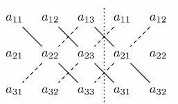

# Matrices
Matrix is just a 'group' (or array) of elements (numbers, symbols, or expressions). 
A matrix with `m rows` and `n columns` is read as an m by n matrix

$$
A=\begin{bmatrix}
a_{11} & a_{12} & a_{13}  & \cdots & a_{1n} \\
a_{21} & a_{22} & a_{23} & \cdots & a_{2n} \\
a_{31} & a_{32} & a_{33} & \cdots & a_{3n} \\
\vdots  & \vdots & \vdots & \ddots & \vdots  \\
a_{m1} & a_{m2} & a_{m3} & \cdots & a_{mn}
\end{bmatrix}
$$

where $a_{ij}$ are the elements
- A matrix, that is $m\times 1$ is called a vector
	- means 1 column

Many data can be represented by a matrix (**display information**)
- Excel
- Database
Example:  
A table of numbers:

| 5   | 1   | 0   |
| --- | --- | --- |
| 5   | 1   | 0   |
| 4   | 1   | 1   |
Can be represented by a matrix:  
$\begin{pmatrix}\end{pmatrix}\begin{bmatrix}5 & 1 & 0 \\ 5 & 1 & 0 \\ 4 & 1 & 1\end{bmatrix}$

# System of Linear Equations
Has the following form:

$$
\begin{gathered}
a_{11}x_{1}+a_{12}x_{2}+\dots+a_{1n}x_{n}=b_{1}\\
a_{21}x_{1}+a_{22}x_{2}+\dots+a_{2n}x_{n}=b_{2}\\
\vdots\\
a_{m1}x_{1}+a_{m2}x_{2}+\dots+a_{mn}x_{n}=b_{m}
\end{gathered}
$$

where there are m equations with n unknown variables, $x_{1}$ to $x_{n}$. 
- The $a_{ij}$ are constant coefficients and the $b_{i}$ are constants of the system.

Examples:
1. 

$$
\begin{gathered}
2x+3y=1\\
x-7y=-14
\end{gathered}
$$

- A system with 2 variables: x and y
	- m = 2 (rows)
		- determine the number of constants
	- n = 2 (columns)
		- determine the number of variables **per row**
		- determine the number of constant coefficients **per row**
	- Total constant coefficients = $m\times n$ = 4

2. 

$$
\begin{gathered}
2x+y-z=1\\
2x-5y-z=7\\
x+y+z=1
\end{gathered}
$$

- A system with 3 variables: x, y and z
	- m = 3
	- n = 3

3. 

$$
\begin{gathered}
w_{11}+x_{1}+w_{12}x_{2}+w_{13}x_{3}+w_{14}x_{4}=b_{1}\\
w_{21}+x_{1}+w_{22}x_{2}+w_{23}x_{3}+w_{24}x_{4}=b_{2}\\
w_{31}+x_{1}+w_{32}x_{2}+w_{33}x_{3}+w_{34}x_{4}=b_{3}
\end{gathered}
$$

- A system with 4 variables: $x_{1},x_{2},x_{3} ~\&~x_{4}$
	- m = 3
	- n = 4

## Connection to Matrices
Matrices and determinants are mainly used to solve simultaneous linear equations (SLE)
- can represent various real-world situations

Simple Example:  
$2x+3y=-2$ ~ (1)  
$3x+4y=-6$ ~ (2)  
Answer: $x=-10,y=6$

Use matrix algebra to solve similar problems

## Represent SLEs with matrices
Example:  
$2x+3y=-2$ ~ (1)  
$3x+4y=-6$ ~ (2)  
The coefficients of the variables for linear simultaneous equations can be shown in matrix form:  
$\begin{pmatrix}2  & 3 \\ 3 & 4\end{pmatrix}$

Example:  
$1.3p-2.0p+r=7$ ~ (1)  
$3.7p+4.8q-7r=3$ ~ (2)  
$4.1p+3.8q+12r=-6$ ~ (3)  
Coefficients represented in this form:  
$\begin{pmatrix}1.3 & -2.0 & 1 \\ 3.7 & 4.8 & -7 \\ 4.1 & 3.8 & 12\end{pmatrix}$

# Square Matrix/Column Vector/Row vector
- If m = n, then the array is square, and a matrix $A$ is **called a square matrix of order** n
- If the matrix has 1 column or 1 row, then it is called **a column vector or a row vector**, respectively.
	- Row vector: $a=[a_{1},a_{2},\dots,a_{n}]$
	- Column vector: $b=\begin{bmatrix}b_{1} \\ b_{2} \\ \vdots \\ bm\end{bmatrix}$

# Special Matrices
## Unit Matrix (Identity I)
**Unit matrix** or Identity, $\mathrm{I}$ is a square matrix whose only non-zero elements are on the diagonal and are equal to one.  
Example:  

$$
\begin{gathered}
\mathrm{I}=\begin{pmatrix}
1 & 0 & 0 \\
0 & 1 & 0 \\
0 & 0 & 1
\end{pmatrix},\mathrm{I}=\begin{pmatrix}
1 & 0 & 0 & \cdots & 0 & 0 \\
0 & 1 & 0 & \cdots & 0 & 0 \\
0 & 0 & 1 & \cdots & 0 & 0 \\
\vdots & \vdots & \vdots & \ddots & \vdots & \vdots \\
0 & 0 & 0 & \cdots & 1 & 0 \\
0 & 0 & 0 & \cdots & 0 & 1
\end{pmatrix}
\end{gathered}
$$

## Zero Matrix (0)
- all elements of the zero matrix are equal to 0
Example:

$$
\mathrm{0}=\begin{pmatrix}
0 & 0 & 0 \\
0 & 0 & 0 \\
0 & 0 & 0
\end{pmatrix},\mathrm{0}=\begin{pmatrix}
0 & 0 & 0 & \cdots & 0 & 0 \\
0 & 0 & 0 & \cdots & 0 & 0  \\
0 & 0 & 0 & \cdots & 0 & 0  \\
\vdots & \vdots & \vdots & \ddots & \vdots & \vdots  \\
0 & 0 & 0 & \cdots & 0 & 0  \\
0 & 0 & 0 & \cdots & 0 & 0 \\
\end{pmatrix}
$$

## Diagonal Matrix (D)
- only has non-zero elements on the main diagonal
	- non-zero elements can have any value
Example:

$$
\mathrm{D}=\begin{pmatrix}
d_{11} & 0 & 0 \\
0 & d_{22} & 0 \\
0 & 0 & d_{33}
\end{pmatrix},\mathrm{D}=\begin{pmatrix}
d_{11} & 0 & \cdots & 0 & 0 \\
0 & d_{22} & \cdots & 0 & 0 \\
\vdots & \vdots & \ddots & \vdots & \vdots \\
0 & 0 & \cdots & d_{n-1,n-1} & 0 \\
0 & 0 & \cdots & - & d_{nn}
\end{pmatrix}
$$

# Matrix Equality
2 matrices are equal if and only if they have the same size and all their elements are the same

# Matrix Addition
2 matrices can only be added if they have the same size  
Example:  
$\begin{pmatrix}3 & 1 & -4 \\ 4 & 3 & 1 \\ 1 & 4 & -3\end{pmatrix}+\begin{pmatrix}2 & 7 & -5 \\ -2 & 1 & 0 \\ 6 & 3 & 4\end{pmatrix}=\begin{pmatrix}5 & 8 & -9 \\ 2 & 4 & 1 \\ 7 & 7 & 1\end{pmatrix}$

# Matrix Subtraction
2 matrices can be subtracted if they have the same size  
Example:  
$\begin{pmatrix}3 & 1 & -4 \\ 4 & 3 & 1 \\ 1 & 4 & -3\end{pmatrix}-\begin{pmatrix}2 & 7 & -5 \\ -2 & 1 & 0 \\ 6 & 3 & 4\end{pmatrix}=\begin{pmatrix}1 & -6 & 1 \\ 6 & 2 & 1 \\ -5 & 1 & -7\end{pmatrix}$

# Matrix Multiplication by a scalar
Multiply each element by the scalar number  
Example:  
$2\begin{pmatrix}3 & 1 & -4 \\ 4 & 3 & 1 \\ 1 & 4 & -3\end{pmatrix}=\begin{pmatrix}6 & 2 & -8 \\ 8 & 6 & 2 \\ 2 & 8 & -6\end{pmatrix}$

# Transpose & Properties of the transpose
Let $A$ be an $m\times n$ matrix with elements $a_{ij}$. The transpose of $A$, denoted by $A^T$ is the $n\times m$ matrix with elements $a_{ji}$.
- The rows and columns swap

Example:

$$
{A}=\begin{pmatrix}
2 & 3 \\
1 & 2 \\
4 & 5
\end{pmatrix},{A}^{{T}}=\begin{pmatrix}
2 & 1 & 4 \\
3 & 2 & 5
\end{pmatrix}
$$

Properties of the transpose:
1. $(A^T)^T=A$
2. $(A+B)^T=A^T+B^T$
3. $(AB)^T=B^TA^T$
	- $\neq A^TB^T$

A matrix is symmetric if $A^T=A$
- matrix is also a **square matrix**
- $\begin{pmatrix}5 & 0 & 1 \\ 0 & 2 & 5 \\ 1 & 5 & 6\end{pmatrix}$, kind of like a mirror
A matrix is called skew-symmetric if $A^T=-A$
- negative mirror
- proven that the diagonal elements are 0
- $A=\begin{pmatrix}0 & 5 & 3 \\ -5 & 0 & 2 \\ -3 & -2 & 0\end{pmatrix}$
	- $A^T=\begin{pmatrix}0 & -5 & -3 \\ 5 & 0 & -2 \\ 3 & 2 & 0\end{pmatrix}$
	- $-A=\begin{pmatrix}0 & -5 & -3 \\ 5 & 0 & -2 \\ 3 & 2 & 0\end{pmatrix}$

## Basic Rules of addition
1. Commutative Law
	- $A+B=B+A$
2. Associative Law
	- $(A+B)+C=A+(B+C)$
3. Distributive Law
	- $\lambda(A+B)=\lambda A+\lambda B$

# Matrix Multiplication
Formal definition: If $A$ is an $m\times p$ matrix with elements $a_{ij}$ and $B$ a $p\times n$ matrix with elements $b_{ij}$, then we define the product $C=AB$ as the $m\times n$ matrix with components  
$$C_{ij}=\sum^p_{k=1}a_{ik}b_{kj}=a_{i_{1}}b_{1j}+\dots+a_{ip}b_{pj}~~~,~~i=1,\dots,m,~~j=1,\dots,n$$

Theoretical Example:  
Matrix A has $m\times p$ elements
- $A=\begin{pmatrix}a_{11} & a_{12} & \cdots & a_{1p} \\ a_{21} & a_{22} & \cdots & a_{2p} \\ \vdots & \vdots & \ddots & \vdots \\ a_{m1} & a_{m2} & \cdots & a_{mp}\end{pmatrix}$
Matrix B has $p\times n$ elements
- $B=\begin{pmatrix}b_{11} & b_{12} & \cdots & b_{1n} \\ b_{21} & b_{22} & \cdots & b_{2n} \\ \vdots & \vdots & \ddots & \vdots \\ b_{p1} & b_{p2} & \cdots & b_{pn}\end{pmatrix}$
To multiply 2 matrices together, first matrix columns need to be the same as the second matrix rows
- $C=A\times B$
	- Dot Product
	- $C_{11}=(\text{Transpose of row 1 of A})\cdot(\text{Column 1 of B})$
		- $\begin{bmatrix}a_{11} \\ a_{12} \\ \vdots  \\ a_{1p}\end{bmatrix}\cdot \begin{bmatrix}b_{11} \\ b_{21} \\ \vdots  \\ b_{p1}\end{bmatrix}=a_{11}b_{11}+a_{12}b_{12}+a_{1p}b_{p1}$
	- $C_{ij}=(\text{transpose of row i of A})\cdot(\text{column of j of B})$

Example:  
$\begin{bmatrix}2 & 3  & 1 \\ -1 & 2 & 4\end{bmatrix} \begin{bmatrix}5 & 3 \\ 4 & 0 \\ 3 & 1\end{bmatrix}=\begin{bmatrix}2\times 5+3\times 4+1\times 3 & 2\times 3+3\times 0+1\times 1 \\ -1\times 5+2\times 4+4\times 3 & -1\times 3+2\times 0+4\times 1\end{bmatrix}=\begin{bmatrix}25 & 7 \\ 15 & 1\end{bmatrix}$
- (2 by 3) x (3 by 2) = (2 by 2)

## Properties of Matrix Multiplication
1. Not Commutative
	- $AB\neq BA$
2. Associative Law
	- $A(BC)=(AB)C$ where A is $m\times p$, B is $p\times q$ and C is $q\times n$
3. Distributive law over addition
	- $(A+B)C=AC+BC$
	- $A(B+C)=AB+AC$
4. Multiplication by unit matrices
	- $IA=A=AI$
		- I is a unit matrix/identity matrix
5. Transpose of a product
	- $(AB)^T=B^TA^T$

# Determinants
- crucial to the solution of linear equations

## 2x2 Square Matrix Determinant
Given a square matrix,
- Example: $A=\begin{pmatrix}a & b \\ c & d\end{pmatrix}$
	- The determinant of A, denoted by det A or $|A|$, is given by

$$
|A|=ad-bc
$$

- cross multiply, then subtract

Example:  
Determine the value of $\begin{vmatrix}3 & -2 \\ 7 & 4\end{vmatrix}$
- $=3\times 4-7\times-2=26$

## 3x3 Square Matrix Determinant
### Minor of an element and the Signed-Minor (Cofactor)
1. The minor of an element of a 3x3 matrix is the value of the 2x2 **determinant** obtained by the covering up the row and column containing that element
	- Then cross multiply and subtract
2. The sign of a minor depends on its position within the matrix, the sign pattern being $\begin{pmatrix}+ & - & + \\ - & + & - \\ + & - & +\end{pmatrix}$
	- A trick is to see the element $a_{ij}$,
		- if $i+j$ is even, the sign of the minor is positive
		- if $i+j$ is odd, the sign of the minor is negative
	- Signed-minor is also known as the **cofactor of the element**
	- Formula: $A_{22}=(-1)^{(i+j)}M_{ij}$

Example:  
The minor of element 4 in the matrix$\begin{pmatrix}1 & 2 & 3 \\ 4 & 5 & 6 \\ 7 & 8 & 9\end{pmatrix}$ obtained by covering the row $\begin{pmatrix}4 & 5 & 6\end{pmatrix}$ and the column $\begin{pmatrix}1 \\ 4 \\ 7\end{pmatrix}$, leaving the 2x2 determinant $\begin{vmatrix}2 & 3 \\ 8 & 9\end{vmatrix}$
- The minor of element 4 is $2\times 9-8\times 3=-6$
- The signed-minor (determinant for this matrix) is $-(-6)=6$

### Calculating 3x3 Determinant
3. The value of a 3x3 determinant is $\text{sum of }(\text{elements}\times\text{their cofactors})$ of any row/column
	- 6 different ways of evaluating a 3x3 determinant and all give the same value

Example:  
Calculate the determinant for $\begin{pmatrix}3 & 4 & -1 \\ 2 & 0 & 7 \\ 1 & -3 & -2\end{pmatrix}$
- If choose the 1st row
	- Minor of element 3: $0\times -2-7\times-3 = 21$
		- cofactor is $21$
	- Minor of element 4: $2\times-2-7\times 1=-11$
		- cofactor is $11$
	- Minor of element -1: $2\times-3-0\times 1=-6$
		- cofactor is $-6$
	- $3(21)+4(11)-1(-6)=113$
- If choose the 2nd row
	- Cofactor of element 2: $-(4\times-2-(-1\times-3))=11$
	- Cofactor of element 0: $+(3\times-2-1\times-1)=-5$
	- Cofactor of element 7: $-(3\times-3-4\times 1)=13$
	- $11\times 2+0\times-5+7\times 13=113$

### Rule of Sarrus
$$
\det(M)=\begin{vmatrix}
a_{11} & a_{12} & a_{13} \\
a_{21} & a_{22} & a_{23} \\
a_{31} & a_{32} & a_{33}
\end{vmatrix}=a_{11}a_{22}a_{33}+a_{12}a_{23}a_{31}+a_{13}a_{21}a_{32}-a_{13}a_{22}a_{31}-a_{12}a_{21}a_{33}-a_{11}a_{23}a_{32}
$$

The determinant can be calculated using Rule of Sarrus.

## Vector Cross Product and the 3x3 Matrix
Since $\vec{a}=\begin{bmatrix}a_{1} \\ a_{2} \\ a_{3}\end{bmatrix},\vec{b}=\begin{bmatrix}b_{1} \\ b_{2} \\ b_{3}\end{bmatrix}$  
Can be written as 
- $\vec{a}=a_{1}\hat{i}+a_{2}\hat{j}+a_{3}\hat{k}$
- $\vec{b}=b_{1}\hat{i}+b_{2}\hat{j}+b_{3}\hat{k}$
Can be written as a determinant of a matrix, choosing the first row

$$
\vec{a}\times \vec{b}=\begin{vmatrix}
\hat{i} & \hat{j} & \hat{k} \\
a_{1} & a_{2} & a_{3} \\
b_{1} & b_{2} & b_{3}
\end{vmatrix}=\hat{i}(a_{2}b_{3}-a_{3}b_{2})+\hat{j}(-1)(a_{1}b_{3}-a_{3}b_{1})+\hat{k}(a_{1}b_{2}-a_{2}b_{1})
$$

# Adjoint and Inverse of Matrix
## Adjoint Matrix
- defined as the transpose of the matrix of cofactors

1. Compute the Cofactors and turn them into the Cofactor Matrix
	- $A_{ij}=(-1)^{i+j}M_{ij}$
	- $\begin{bmatrix}a_{11} & a_{12} & \cdots & a_{1n} \\ a_{21} & a_{22} & \cdots & a_{2n} \\ \vdots & \vdots & \ddots & \vdots \\ a_{m1} & a_{m2} & \cdots & a_{mn}\end{bmatrix} \to \begin{bmatrix}M_{11} & M_{12} & \cdots &  M_{1n} \\ M_{21} & M_{22} & \cdots & M_{2n} \\ \vdots & \vdots & \ddots & \vdots \\ M_{m1} & M_{m2} & \cdots & M_{mn}\end{bmatrix}\to\begin{bmatrix}A_{11} & A_{12} & \cdots &  A_{1n} \\ A_{21} & A_{22} & \cdots & A_{2n} \\ \vdots & \vdots & \ddots & \vdots \\ A_{m1} & A_{m2} & \cdots & A_{mn}\end{bmatrix}$
2. Determine the transpose of the Cofactor Matrix
	- $adj(A)=\begin{bmatrix}A_{11} & A_{12} & \cdots &  A_{1n} \\ A_{21} & A_{22} & \cdots & A_{2n} \\ \vdots & \vdots & \ddots & \vdots \\ A_{m1} & A_{m2} & \cdots & A_{mn}\end{bmatrix}^T$

### Adjoint of 2x2 Matrix
- $A=\begin{bmatrix}p & q \\ r & s\end{bmatrix}$
- Minor Matrix = $\begin{bmatrix}s & r \\ q & p\end{bmatrix}$
	- Just cover the column and row like in a 3x3 matrix
- Cofactor Matrix = $\begin{bmatrix}s & -r \\ -q & p\end{bmatrix}$
- Adjoint Matrix = $\begin{bmatrix}s & -q \\ -r & p\end{bmatrix}$

Remember the shortcut method

### Adjoint of 3x3 Matrix
Example:  
Given $A=\begin{pmatrix}1 & 1 & 2 \\ 2 & 0 & 1 \\ 3 & 1 & 1\end{pmatrix}$, find the $adjA$  
$adjA=\begin{pmatrix}\begin{vmatrix}0 & 1 \\ 1 & 1\end{vmatrix} & -\begin{vmatrix}2 & 1 \\ 3 & 1\end{vmatrix} & \begin{vmatrix}2 & 0  \\ 3 & 1\end{vmatrix} \\ -\begin{vmatrix}1 & 2 \\ 1 & 1\end{vmatrix} & \begin{vmatrix}1 & 2 \\ 3 & 1\end{vmatrix} & -\begin{vmatrix}1 & 1 \\ 3 & 1\end{vmatrix} \\ \begin{vmatrix}1 & 2 \\ 0 & 1\end{vmatrix} & -\begin{vmatrix}1 & 2 \\ 2 & 1\end{vmatrix} & \begin{vmatrix}1 & 1 \\ 2 & 0\end{vmatrix}\end{pmatrix}^T=\begin{pmatrix}-1 & 1 & 2 \\ 1 & -5 & 2 \\ 1 & 3 & -2\end{pmatrix}^T=\begin{pmatrix}-1 & 1 & 1 \\ 1 & -5 & 2 \\ 2 & 2 & -2\end{pmatrix}$

## Inverse Matrix
Given a square matrix $A$, if we can construct a matrix $B$ such that:  

$$
BA=AB=I
$$

Then $B$ is called the inverse matrix of A, denoted as $A^{-1}$
- $B=A^{-1}$
- $A^{-1}A=I$
- $AA^{-1}=I$

Defined by this formula:

$$
A^{-1}=\frac{adjA}{|A|}
$$

- For the inverse to exist, matrix A must be a **square matrix**
- The inverse matrix is also a **square matrix**
- The inverse of a square matrix may not always exist
	- because of determinant being 0 or other factors like linear independence

Example:  
Determine the inverse of the matrix $A=\begin{pmatrix}3 & 4 & -1 \\ 2 & 0 & 7 \\ 1 & -3 & -2\end{pmatrix}$
- Minor Matrix = $\begin{pmatrix}0-(-21) & -4-7 & -6-0 \\ -8-3 & -6-(-1) & -9-4 \\ 28-0 & 21-(-2) & 0-8\end{pmatrix}=\begin{pmatrix}21 & -11 & -6 \\ -11 & -5 & -13 \\ 28 & 23 & -8\end{pmatrix}$
- Cofactor Matrix = $\begin{pmatrix}21 & 11 & -6 \\ 11 & -5 & 13 \\ 28 & -23 & -8\end{pmatrix}$
- Determinant = $21(3)+(11(4))+(-6(-1))=113$
- Adjoint Matrix = $\begin{pmatrix}21 & 11 & 28 \\ 11 & -5 & -23 \\ -6 & 13 & -8\end{pmatrix}$
- Inverse Matrix = $\frac{adj(A)}{|A|}=\frac{1}{113}\begin{pmatrix}21 & 11 & 28 \\ 11 & -5 & -23 \\ -6 & 13 & -8\end{pmatrix}$

### Multiplicative Inverse
Let A be an $n\times n$ matrix. If there exists an $n\times n$ matrix $A^{-1}$ such that

$$
AA^{-1}=I_{n}~~,~~A^{-1}A=I_{n}
$$

is the multiplicative inverse of A 
- (basically same as the inverse of A)

If the square matrix has a multiplicative inverse, it is said to be **invertible** or **nonsingular**.  
If a square matrix has no multiplicative inverse, it is called **singular**.