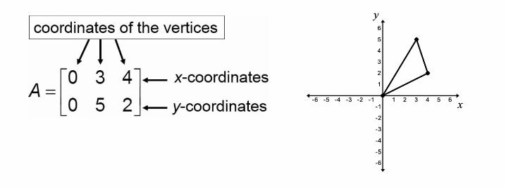
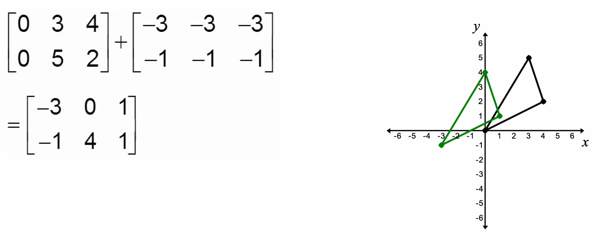
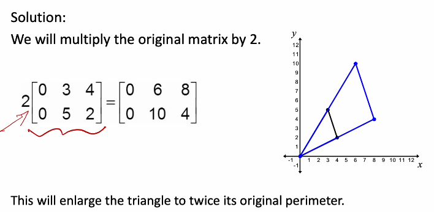
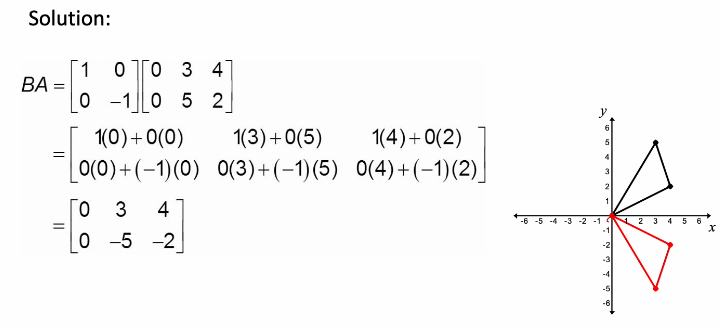
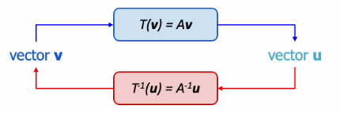
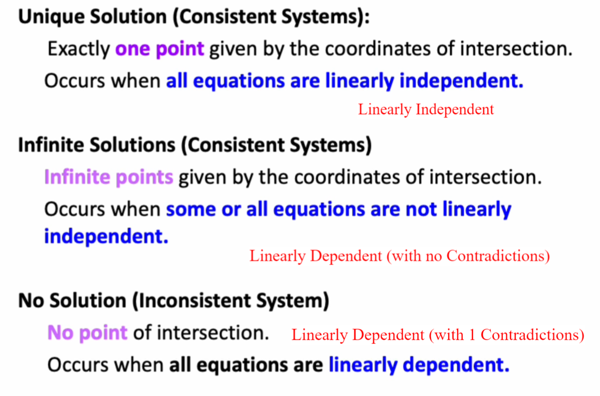

A system of 2 linear equations can be written using matrices in the form:

$$
\begin{gathered}
2x+3y=1\\
x-7y=-14\\
\downarrow\\
\begin{bmatrix}
2 & 3 \\
1 & -7
\end{bmatrix}\begin{bmatrix}
x \\
y
\end{bmatrix}=\begin{bmatrix}
1 \\
-14
\end{bmatrix}
\end{gathered}
$$

The matrices are in the form of

$$
Av=b
$$

where
- **A** is the matrix of coefficients
- **v** is a vector of variables
- **b** is a vector constants
**Matrix A** transforms a vector **v** into another vector **b**

It shows an example of **linear transformation** in linear algebra by multiplying a matrix with a vector, which results in another vector

# Applications: Transformation of an Image
A triangle represented by a matrix:  

- Move the triangle by adding/subtracting x or y elements in the matrix
	- 
- Enlarge the triangle by multiplying the original matrix
	- 
- Reflect the original triangle over the x-axis
	- 

# Linear Transformation
- aka linear mapping or linear function

Linear Transformation denoted by:

$$
T:V \mapsto U
$$

- takes an input vector space **V** and produces an output vector space **U** such that it satisfies:
	- For any $\vec{v_{1}},\vec{v_{2}}\in V$ and any scalar $k\in \mathbb{R}$
	1. **Additivity**: $T(\vec{v_{1}}+\vec{v_{2}})=T(\vec{v_{1}})+T(\vec{v_{2}})$
	2. **Homogeneity:** $T(kv)=kT(v)$

# Inverse of a Linear Transformation
- The inverse of a linear transformation **might exist such that:**
	- 
		- Where T is a function, A is a matrix
		- Vector v transformed with $T$ into vector u
			- $T(v)=u$
			- $Av=u$
		- Vector u transformed with $T^{-1}$ into vector v
			- $T^{-1}(u)=v$
			- $A^{-1}u=v$

Definition of an inverse linear transformation:

$$
\begin{gathered}
T(T^{-1}(v))=T^{-1}(T(v))=v\\
AA^{-1}v=A^{-1}Av=v
\end{gathered}
$$

Invertible Matrix / Nonsingular Matrix:  
A square matrix $A$ with $n\times n$ is called **invertible/nonsingular** if there exist a square $n \times n$ matrix $A^{-1}$ such that:  
$AA^{-1}=A^{-1}A=I$
- A **square** matrix is **invertible** if it has a [Multiplicative Inverse](../9Matrices/Matrices.md#Multiplicative%20Inverse)
	- Inverse of Matrix A given by: $A^{-1}=\frac{A_{adj}}{\det(A)}$

Checking the inverse of the matrix by using the definition:  
For any square matrices ($2\times 2$ and $3\times 3$): $AA^{-1}=I$

# Solving Sets of Linear Equations (Inverse matrix method)
Matrices is used to solve sets of linear equations

$$
\begin{gathered}
A\vec{x}=\vec{b}\\
(A^{-1}A)\vec{x}=A^{-1}\vec{b}\\
I\vec{x}=A^{-1}\vec{b}\\
\vec{x}=A^{-1}\vec{b}
\end{gathered}
$$

Example:

$$
\begin{gathered}
x+2y=3\\
x+y=4\\
2x+y+z=5\\
\downarrow\\
\begin{bmatrix}
1 & 2 & 0 \\
1 & 1 & 0 \\
2 & 1 & 1
\end{bmatrix}\begin{bmatrix}
x \\
y \\
z
\end{bmatrix}=\begin{bmatrix}
3 \\
4 \\
5
\end{bmatrix}\\
\begin{bmatrix}
x \\
y \\
z 
\end{bmatrix}=\begin{bmatrix}
1 & 2 & 0 \\
1 & 1 & 0 \\
2 & 1 & 1
\end{bmatrix}^{-1}\begin{bmatrix}
3 \\
4 \\
5
\end{bmatrix}
\end{gathered}
$$

Example:

$$
\begin{gathered}
x+y+z=6\\
x+2y+3z=14\\
x+4y+9z=36\\
\downarrow\\
\begin{bmatrix}
1 & 1 & 1 \\
1 & 2 & 3 \\
1 & 4 & 9
\end{bmatrix}\begin{bmatrix}
x \\
y \\
z
\end{bmatrix}=\begin{bmatrix}
6 \\
14 \\
36
\end{bmatrix}\\
\begin{bmatrix}
x \\
y \\
z
\end{bmatrix}=\begin{bmatrix}
1 & 1 & 1 \\
1 & 2 & 3 \\
1 & 4 & 9
\end{bmatrix}^{-1}\begin{bmatrix}
6 \\
14 \\
36
\end{bmatrix}\\
\begin{bmatrix}
x \\
y \\
z
\end{bmatrix}=\frac{1}{2}\begin{bmatrix}
6 & -5 & 1 \\
-6 & 8 & -2 \\
2 & -3 & 1
\end{bmatrix}\begin{bmatrix}
6 \\
14 \\
36
\end{bmatrix}\\
\begin{bmatrix}
x \\
y \\
z
\end{bmatrix}=\begin{bmatrix}
1 \\
2 \\
3
\end{bmatrix}\\
x = 1, y= 2, z = 3
\end{gathered}
$$

# Significance of Determinants
## Square Examples
$$
\begin{gathered}
M=\begin{bmatrix}
0 & 1 & 1 & 0 \\
0 & 0 & 1 & 1
\end{bmatrix}, A=\begin{bmatrix}
2 & 0 \\
0 & 2
\end{bmatrix}\\
AM=\begin{bmatrix}
0 & 2 & 2 & 0 \\
0 & 0 & 2 & 2
\end{bmatrix}
\end{gathered}
$$

- The square will enlarge by 4x
- The determinant of A is $2\times 2-0=4$
	- Determinant gives the ratio of area of original square to the area of new square

$$
\begin{gathered}
M=\begin{bmatrix}
0 & 1 & 1 & 0 \\
0 & 0 & 1 & 1
\end{bmatrix}, A=\begin{bmatrix}
0.5 & 0 \\
0 & 1
\end{bmatrix}\\
AM=\begin{bmatrix}
0 & 0.5 & 0.5 & 0 \\
0 & 0 & 1 & 1
\end{bmatrix}
\end{gathered}
$$

- Determinant of A: $0.5\times 1-0=0.5$
- The area of the new square is halved

$$
\begin{gathered}
M=\begin{bmatrix}
0 & 1 & 1 & 0 \\
0 & 0 & 1 & 1
\end{bmatrix}, A=\begin{bmatrix}
-1 & 0  \\
0 & 1
\end{bmatrix}\\
AM=\begin{bmatrix}
0 & -1 & -1 & 0 \\
0 & 0 & 1 & 1
\end{bmatrix}
\end{gathered}
$$

- Determinant of A: $-1\times 1-0=-1$
- The area of the new square is **reflected on the y-axis**

## 3D Cube Example
$$
\begin{gathered}
M=\begin{bmatrix}
0 & 1 & 0 & 0 & 1 & 1 & 0 & 1 \\
0 & 0 & 1 & 0 & 1 & 0 & 1 & 1 \\
0 & 0 & 0 & 1 & 0 & 1 & 1 & 1
\end{bmatrix},B=\begin{bmatrix}
2 & 0 & 0 \\
0 & 2 & 0 \\
0 & 0 & 2
\end{bmatrix}\\
BM=\begin{bmatrix}
0 & 2 & 0 & 0 & 2 & 2 & 0 & 2 \\
0 & 0 & 2 & 0 & 2 & 0 & 2 & 2 \\
0 & 0 & 0 & 2 & 0 & 2 & 2 & 2
\end{bmatrix}
\end{gathered}
$$

- Determinant of B: $2\times 2\times 2=8$
	- The volume of the cube will **increase by factor** of 8

# Cramer's Rule
- A method to solve sets of linear equations
Given:
- $a_{11}x+a_{12}y+a_{13}z=b_{1}$
- $a_{21}x+a_{22}y+a_{23}z=b_{2}$
- $a_{31}x+a_{32}y+a_{33}z=b_{3}$
Can solve:

$$
\begin{gathered}
x=\frac{D_{x}}{D}\\
y=\frac{D_{y}}{D}\\
z=\frac{D_{z}}{D}
\end{gathered}
$$

using:

$$
\begin{gathered}
D=\begin{vmatrix}
a_{11} & a_{12} & a_{13} \\
a_{21} & a_{22} & a_{23}  \\
a_{31} & a_{32} & a_{33}
\end{vmatrix}\\
D_{x}=\begin{vmatrix}
b_{1} & a_{12} & a_{13} \\
b_{2} & a_{22} & a_{23}  \\
b_{3} & a_{32} & a_{33}
\end{vmatrix}\\
D_{y}=\begin{vmatrix}
a_{11} & b_{1} & a_{13} \\
a_{21} & b_{2} & a_{23}  \\
a_{31} & b_{3} & a_{33}
\end{vmatrix}\\
D_{z}=\begin{vmatrix}
a_{11} & a_{12} & b_{1} \\
a_{21} & a_{22} & b_{2}  \\
a_{31} & a_{32} & b_{3}
\end{vmatrix}
\end{gathered}
$$

If determinant is 0 (i.e. coefficient matrix is not invertible)

Example:

$$
\begin{gathered}
x+y+z=6\\
x+2y+3z=14\\
x+4y+9z=36\\
D=\begin{vmatrix}
1 & 1 & 1 \\
1 & 2 & 3 \\
1 & 4 & 9
\end{vmatrix}=1(2\times 9-3\times 4)-1(1\times 9-3\times 1)+1(1\times 4-2\times 1)=2\\
D_{x}=\begin{vmatrix}
6 & 1 & 1 \\
14 & 2 & 3 \\
36 & 4 & 9
\end{vmatrix}=6(2\times 9-4\times 3)-1(14\times 9-36\times 3)+1(14\times 4-36\times 2)=2\\
D_{y}=\begin{vmatrix}
1 & 6 & 1 \\
 1 & 14 & 3 \\
1 & 36 & 9
\end{vmatrix}=4\\
D_{z}=\begin{vmatrix}
1 & 1 & 6 \\
1 & 2 & 14 \\
1 & 4 & 36
\end{vmatrix}=6\\
\frac{D_{x}}{D}=\frac{2}{2}=1,\frac{D_{y}}{D}=\frac{4}{2}=2, \frac{D_{z}}{D}=\frac{6}{2}=3
\end{gathered}
$$

# Gaussian Elimination
A matrix-like way to solve simultaneous equations
- Can only solve equations that are consistent with finite solutions $\downarrow$

Example:

$$
\begin{gathered}
x+2y=8\\
3x-y=7\\
\text{Write in the form of Ax=b}\\
\begin{bmatrix}
1 & 2 \\
3 & -1\\
\end{bmatrix}\begin{bmatrix}
x \\
y
\end{bmatrix}=\begin{bmatrix}
8 \\
7
\end{bmatrix}\\
\text{Create the Augmented Matrix}\\
\begin{bmatrix}
1 & 2 & | & 8 \\
3 & -1 & | & 7
\end{bmatrix}
\end{gathered}
$$

- Goal: To make specific elements on the left to be 0 and the diagonal to be 1 (or not)$\downarrow$
	- Row echelon form
- 3 methods to solve using matrices 
	1. Scale: Multiply a row by constant k, $k\neq 0$
	2. Swapping rows
	3. Elimination: adding or subtracting a multiple of 1 row from another

$$
\begin{gathered}
\text{Elimination method}\\
R_{2}-3R_{1}\to R_{2}\\
\begin{bmatrix}
1 & 2 & | & 8 \\
3 & -1 & | & 7
\end{bmatrix}\to \begin{bmatrix}
1 & 2 & | & 8 \\
0 & -7 & | & -17
\end{bmatrix}
\end{gathered}
$$

- Second row is a partial form of the **row echelon form**
	- True row echelon form is when there is also 1s on the diagonals
- Can now solve it using back-substitution:

$$
\begin{gathered}
\text{Back substitution}\\
-7y=17\\
y=\frac{17}{7}\\
x+2y=8\\
x+2\left( \frac{17}{7} \right)=8\\
x=\frac{22}{7}
\end{gathered}
$$

Example (3 equations):

$$
\begin{gathered}
x+2y+3z=3\\
2x+3y+z=3\\
x+2y+z=1\\
\begin{bmatrix}
1 & 2 & 3 \\
2 & 3 & 1 \\
1 & 2 & 1
\end{bmatrix}\begin{bmatrix}
x \\
y \\
z
\end{bmatrix}=\begin{bmatrix}
3 \\
3 \\
1
\end{bmatrix}\\
\text{Augmented: }\begin{bmatrix}
1 & 2 & 3 & | & 3 \\
2 & 3 & 1 & | & 3 \\
1 & 2 & 1 & | & 1
\end{bmatrix}\\
R_{2}-2R_{1}\to R_{2}\\
\begin{bmatrix}
1 & 2 & 3 & | & 3 \\
0 & -1 & -5 & | & -3 \\
1 & 2 & 1 & | & 1 \\
\end{bmatrix}\\
R_{3}-R_{1}\to R_{3}\\
\begin{bmatrix}
1 & 2 & 3 & | & 3 \\
0 & -1 & -5 & | & -3 \\
0 & 0 & -2 & | & -2
\end{bmatrix}\\
\text{Back substitution}\\
z=1\\
-y-5(1)=-3\\
y=-2\\
x+2(-2)+3(1)=3\\
x=4
\end{gathered}
$$

- The partial **row echelon form** in the final matrix is the bottom-left triangle of 0s

# Special cases of Sets of Linear Equations
1. If a row is derived $\begin{bmatrix}0 & 0 & 0 & | & 7\end{bmatrix}\implies 0=7$
	- This is impossible and the linear equation is **parallel** on the plane
	- **System of equations is inconsistent with No solution** 
2. If a row is derived $\begin{bmatrix}0 & 0 & 0 & | & 0\end{bmatrix}\implies 0=0$
	- This is possible
	- However, 1 equation is a copy/same of the another
	- **Consistent with Infinite solutions**

# Types of Solutions/Systems
## Inconsistent Systems
Definition: An inconsistent system occurs when, after obtaining an augmented matrix, 1 row of numbers on the left side of the vertical line are all 0s but a 0 does not appear in the same row on the right side of the vertical line
- indicates that the system has no solution
Example:  
$\begin{bmatrix}1 & -1 & -2  & | & 2 \\ 0 & 1 & -10 & | & -1 \\ 0 & 0 & 0 & | & 5\end{bmatrix}$
- It has no solutions

## Dependent Systems
Definition: If a matrix is obtained and a 0 appears across an entire row, the system of equations is dependent.
- indicates **all equations (rows) in the SLE** are linearly independent
- 1 equation can be expressed as a linear combination of the other equations
Example:  
$\begin{bmatrix}1 & 0 & -12 & | & 1 \\ 0 & 1 & -10 & | & -1 \\ 0 & 0 & 0 & | & 0\end{bmatrix}$
- z = z + 0
- Because z can be any value to solve the SLE, this SLE has infinite solutions

## Summary (Geometric interpretation)

- Unique system is deemed as independent consistent system
- No solution
	- The coefficients are linearly dependent, but the **constant** will create a contradiction
		- Think of the y component as the constant, it can move around elsewhere