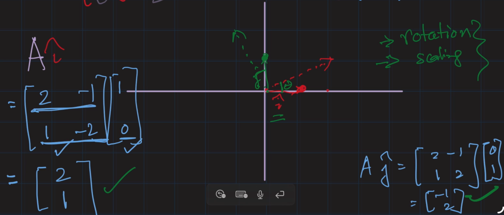
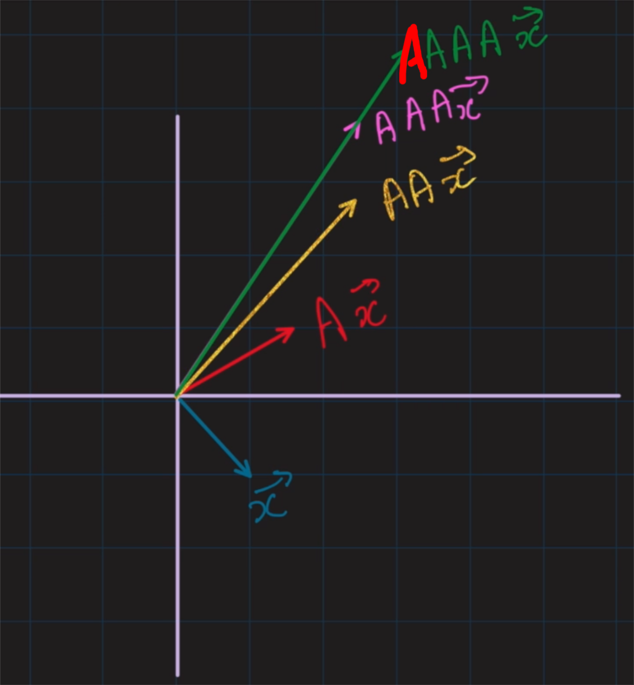

[Linear Transformation](../10LinearTransmission/Linear%20Transformations%20and%20Systems.md#Linear%20Transformation) on unit vectors will result in new basis vectors
- Basis vectors that can be **rotated and scaled**
- 
	- Matrix A transformed $\vec{i}$ and $\vec{j}$ by some angle and scale

# Eigenvalues & Eigenvectors
Consider $A=\begin{bmatrix}2 & 2 \\ 0 & 2\end{bmatrix},\vec{i}=\begin{bmatrix}1 \\ 0\end{bmatrix},\vec{j}=\begin{bmatrix}0  \\  1\end{bmatrix}$
- $A\vec{i}=\begin{bmatrix}2 \\ 0\end{bmatrix}$
	- $\begin{bmatrix}2 \\ 0\end{bmatrix}=2\begin{bmatrix}1 \\ 0\end{bmatrix}$ 
	- This means that $A\vec{i}$ is 2x scale of $\vec{i}$
	- $\vec{i}$ is an eigenvector
	- 2 is the eigenvalue
	- A does not rotate $\vec{i}$, it only scales it
- $A\vec{j}=\begin{bmatrix}2 \\ 2\end{bmatrix}$

Consider $A=\begin{bmatrix}1 & 2 \\ 0 & -2\end{bmatrix}, \vec{x}=\begin{bmatrix}-2 \\ 3\end{bmatrix},\vec{y}=\begin{bmatrix}1  \\ 0\end{bmatrix}$
- $A\vec{x}=\begin{bmatrix}4 \\ -6\end{bmatrix}$
	- $\begin{bmatrix}4 \\ -6\end{bmatrix}=-2\begin{bmatrix}-2 \\ 3\end{bmatrix}$
	- Eigenvector: $\begin{bmatrix}-2 \\ 3\end{bmatrix}$
	- Eigenvalue: -2
- $A\vec{y}=\begin{bmatrix}1 \\ 0\end{bmatrix}$
	- $\begin{bmatrix}1 \\ 0\end{bmatrix}=\begin{bmatrix}1 \\ 0\end{bmatrix}$
	- Eigenvector: $\begin{bmatrix}1 \\ 0\end{bmatrix}$
	- Eigenvalue: 1

Definition:  
For a matrix A with $n\times n$ sides and $\vec{x}$ is a non-zero vector, where

$$
A\vec{x}=\lambda \vec{x}
$$

for some scalar $\lambda$

$$
\begin{gathered}
\lambda\implies \lambda\text{ is an eigenvalue}\\
\vec{x}\implies \vec{x}\text{ is an eigenvector}
\end{gathered}
$$

Example:  
Which vector among these is an eigenvector of A?  

- Since $AAAA\vec{x}$ is the same direction as $AAA\vec{x}$ (and scaled it)
	- $AAAA\vec{x}=A(AAA\vec{x})=\lambda(AAA\vec{x})$
		- $AAA\vec{x}$ is our eigenvector

# Characteristic Equation
- an equation associated with a square matrix that helps in finding its eigenvalues

Derivation of the characteristic equation:

$$
\begin{gathered}
A\vec{x}=\lambda \vec{x}\\
A\vec{x}=\lambda I\vec{x}\\
(A-\lambda I)\vec{x}=0\\
\text{Because }\vec{x}\text{ is an eigenvector, }(A-\lambda I)=0\\
\text{Determinant of a zero matrix is 0}\\
|A-\lambda I|=0
\end{gathered}
$$

- $A-\lambda I$ is known as the characteristic determinant
- Solving for $\lambda$ will give you the eigenvalues

Example:  
Given $A=\begin{pmatrix}0 & 1 \\ 1 & 0\end{pmatrix}$
- $|A-\lambda I|=0$
- $\begin{pmatrix}0 & 1 \\ 1 & 0\end{pmatrix}-\lambda \begin{pmatrix}1 & 0 \\ 0 & 1\end{pmatrix}=\begin{pmatrix}0 & 1  \\ 1 & 0\end{pmatrix}-\begin{pmatrix}\lambda & 0 \\ 0 & \lambda\end{pmatrix}=\begin{pmatrix}-\lambda & 1 \\ 1 & -\lambda\end{pmatrix}$
- Determinant = $(-\lambda)(-\lambda)-(1)(1)=\lambda^2-1$
- $\lambda^{2}-1=0$
	- $\lambda_{1}=1,\lambda_{2}=-1$
		- These are the **eigenvalues**

## Trivial cases before using the equation
For $A\vec{x}=\lambda \vec{x}$
- if $\vec{x}=\vec{0}$, a zero vector, the above equation is trivially satisfiable
- if $A=I$, an identity matrix, the above equation is trivially satisfiable

## Finding the Eigenvector from Eigenvalues
Because of $(A-\lambda I)\vec{x}=0$
- we can find the eigenvectors

Example:  
For $\lambda_{1}=1$
- $(A-\lambda I)\vec{x_{1}}=0$
	- $(\begin{pmatrix}0 & 1 \\ 1 & 0\end{pmatrix}-\begin{pmatrix}\lambda & 0 \\ 0 & \lambda\end{pmatrix})\begin{pmatrix}x_{1_{1}} \\ x_{1_{2}}\end{pmatrix}=\begin{pmatrix}0 \\ 0\end{pmatrix}$
	- $\begin{pmatrix}-\lambda& 1 \\ 1 & -\lambda\end{pmatrix}\begin{pmatrix}x_{1_{1}} \\ x_{1_{2}}\end{pmatrix}=\begin{pmatrix}0 \\ 0\end{pmatrix}$
	- $\begin{pmatrix}-1 & 1 \\ 1 & -1\end{pmatrix}\begin{pmatrix}x_{1_{1}} \\ x_{1_{2}}\end{pmatrix}=\begin{pmatrix}0 \\ 0\end{pmatrix}$
	- $\begin{pmatrix}-x_{1_{1}}+x_{1_{2}} \\ x_{1_{1}}-x_{1_{2}}\end{pmatrix}=\begin{pmatrix}0 \\ 0\end{pmatrix}$
	- Linear equations:
		- $-x_{1_{1}}+x_{1_{2}}=0$
		- $x_{1_{1}}-x_{1_{2}}=0$
		- They both give $x_{1_{1}}=x_{1_{2}}$
	- Eigenvector(s):
		- Since LHS and RHS is the same
		- If LHS is 1, RHS is 1
			- $\begin{pmatrix}1 \\ 1\end{pmatrix}$
		- If LHS is 2, RHS is 2
			- $\begin{pmatrix}2 \\ 2\end{pmatrix}$
		- The 2 eigenvectors are just scaled from one another
For $\lambda=-1$
- $(A-\lambda I)\vec{x_{2}}=0$
- $(A+I)\vec{x_{2}}=0$
	- easy if we substituted lambda in
- $(\begin{bmatrix}0 & 1 \\ 1 & 0\end{bmatrix}+\begin{bmatrix}1 & 0 \\ 0 & 1\end{bmatrix})\vec{x_{2}}=0$
- $\begin{bmatrix}1 & 1  \\ 1 & 1\end{bmatrix}\begin{bmatrix}x_{2_{1}} \\ x_{2_{2}}\end{bmatrix}=\begin{bmatrix}0 \\ 0\end{bmatrix}$
- Linear equations:
	- $x_{2_{1}}+x_{2_{2}}=0$
	- $x_{2_{1}}+x_{2_{2}}=0$
	- $x_{2_{1}}=-x_{2_{2}}$
- Eigenvectors:
	- Can be $\begin{pmatrix}-1 \\ 1\end{pmatrix}$

Example:  
$A=\begin{pmatrix}1 & 1 & -2 \\ -1 & 2 & 1 \\ 0 & 1 & -1\end{pmatrix}$, Find the eigenvalues and some eigenvectors
- $|A-\lambda I|=0$
	- $|\begin{pmatrix}1 & 1 & -2 \\ -1 & 2 & 1 \\ 0 & 1 & -1\end{pmatrix}-\begin{pmatrix}\lambda & 0 & 0 \\ 0 & \lambda & 0 \\ 0 & 0 & \lambda\end{pmatrix}|=0$
	- $|\begin{pmatrix}1-\lambda & 1 & -2 \\ -1 & 2-\lambda & 1 \\ 0 & 1 & -1-\lambda\end{pmatrix}|=0$
	- $0-((1-\lambda)-2)+(-1-\lambda)((1-\lambda)(2-\lambda)+1)=0$
	- $1+\lambda+(-1-\lambda)(1(2-\lambda)-\lambda(2-\lambda)+1)=0$
	- $1+\lambda+(-1-\lambda)(2-\lambda-2\lambda+\lambda^{2}+1)=0$
	- $1+\lambda+(-1-\lambda)(3-3\lambda+\lambda^{2})=0$
	- $1+\lambda+(-1)(3-3\lambda+\lambda^{2})-\lambda(3-3\lambda+\lambda^{2})=0$
	- $1+\lambda+3\lambda-3-\lambda^{2}-3\lambda+3\lambda^{2}-\lambda^{3}=0$
	- $-\lambda^{3}+2\lambda^{2}+\lambda-2=0$
	- $\lambda_{1}=-1,\lambda_{2}=2,\lambda_{3}=1$
- Eigenvector for $\lambda_{1}$:
	- $(A-\lambda I)\vec{x_{1}}=0$
		- $(\begin{pmatrix}1 & 1 & -2 \\ -1 & 2 & 1 \\ 0 & 1 & -1\end{pmatrix}+\begin{pmatrix}1 & 0 & 0 \\ 0 & 1 & 0 \\ 0 & 0 & 1\end{pmatrix})\vec{x_{1}}=0$
		- $\begin{pmatrix}2 & 1 & -2 \\ -1 & 3 & 1 \\ 0 & 1 & 0\end{pmatrix}\vec{x}=\begin{pmatrix}0 \\ 0 \\ 0\end{pmatrix}$
		- $2x_{1}+x_{2}-2x_{3}=0$
		- $-x_{1}+3x_{2}+x_{3}=0$
			- $x_{1}=x_{3}+3x_{2}$
		- $x_{2}=0$
		- Sub last equation into the previous
			- $x_{1}=x_{3}+3(0)$
			- $x_{3}=x_{1}$
	- an eigenvector can be $\begin{pmatrix}1 \\ 0 \\ 1\end{pmatrix}$
- Eigenvector for $\lambda_{2}$:
	- $\begin{pmatrix}-1 & 1 & -2 \\ -1 & 0 & 1 \\ 0 & 1 & -3\end{pmatrix}\vec{x_{2}}=\begin{pmatrix}0 \\ 0 \\ 0\end{pmatrix}$
	- $-x_{1}+x_{2}-2x_{3}=0$
	- $-x_{1}+x_{3}=0$
		- $x_{3}=x_{1}$
	- $x_{2}-3x_{3}=0$
		- $x_{2}=3x_{3}$
	- an eigenvector can be $\begin{pmatrix}1 \\ 3 \\ 1\end{pmatrix}$
- Eigenvector for $\lambda_{3}$
	- $\begin{pmatrix}0 & 1 & -2 \\ -1 & 1 & 1 \\ 0 & 1 & -2\end{pmatrix}\vec{x_{3}}=\begin{pmatrix}0 \\ 0 \\ 0\end{pmatrix}$
	- $x_{2}-2x_{3}=0$
	- $-x_{1}+x_{2}+x_{3}=0$
	- $x_{2}-2x_{3}=0$
		- $x_{2}=2x_{3}$
	- Sub
		- $-x_{1}+2x_{3}+x_{3}=0$
		- $x_{1}=3x_{3}$
	- An eigenvector can be $\begin{pmatrix}3 \\ 2 \\ 1\end{pmatrix}$

## 2 Independent Eigenvectors from 1 eigenvalue with multiplicity of 2
Example:  
Find the eigenvalues and eigenvectors of matrix  
$A=\begin{pmatrix}3 & -3 & 2 \\ -1 & 5 & -2 \\ -1 & 3 & 0\end{pmatrix}$
- ...
- When $\lambda_{2}=\lambda_{3}=2$
	- $\begin{vmatrix}1 & -3 & 2 \\ -1 & 3 & -2 \\ -1 & 3 & -2\end{vmatrix}\vec{e}=0$
	- $1e_{1}-3e_{2}+2e_{3}=0$
	- We get the formula: $e_{1}-3e_{2}+2e_{3}=0$
	- This means we can freely choose any 2 components
	- To get the general solution: 
		- Put it in the form of $e=\begin{pmatrix}? \\ ? \\ ?\end{pmatrix}$
		- $e_{1}=3e_{2}-2e_{3}$
		- Since we can freely choose any 2 components, we choose e2 and e3 to be free
			- Let $e_{2}=\alpha$ and $e_{3}=\beta$
			- $e_{1}=3\alpha-2\beta$
		- $e=\begin{pmatrix}3\alpha-2\beta \\ \alpha \\ \beta\end{pmatrix}$
		- $e=\begin{pmatrix}3\alpha \\ \alpha \\ 0\alpha\end{pmatrix}+\begin{pmatrix}-2\beta \\ 0\beta \\ \beta\end{pmatrix}=\alpha \begin{pmatrix}3 \\ 1 \\ 0\end{pmatrix}+\beta \begin{pmatrix}-2 \\ 0 \\ 1\end{pmatrix}$
- Conclusion: For $\lambda_{2}=\lambda_{3}=2$, the eigenvalue has a multiplicity of 2, and, if possible, seek out 2 independent eigenvectors defined by the formula $e_{1}-3e_{2}+2e_{3}=0$
	- Multiplicity of 2 means that the eigenvalue (2) appears twice as a solution as well as that it is expected to find 2 linearly independent eigenvectors corresponding to the eigenvalue
	- The 2 vectors $\begin{pmatrix}3 \\ 1 \\ 0\end{pmatrix}\&\begin{pmatrix}-2 \\ 0 \\ 1\end{pmatrix}$ are linearly independent, their independence allows for a wider range of solutions when considering transformations associated with this eigenvalue. Essential in real-world applications.

# Trace of Matrix
The trace of a **square matrix** is defined as the sum of its diagonal elements which is always equal to the sum of its eigenvalues

## Eigendecomposition/Diagonalisation
- Another name: spectral decomposition
- Another name: **diagonalisation**

Formula definition:

$$
A=PDP^{-1}
$$

where
- $P=\text{matrix of column eigenvectors}$
	- Note: vectors in a matrix
- $D=\text{diagonal matrix of eigenvalues}$
- $P^{-1}$: inverse of P

If matrices are non-diagonalisable
- they are known as **defective matrices**

Example:  
Diagonalise the matrix A=$\begin{pmatrix}0 & 1 \\ 1 & 0\end{pmatrix}$  
Given that:
- Eigenvalue of 1 results in eigenvector of $\begin{pmatrix}1 \\ 1\end{pmatrix}$
- Eigenvalue of -1 results in eigenvector of $\begin{pmatrix}-1 \\ 1\end{pmatrix}$
$P=\begin{pmatrix}1 & -1 \\ 1 & 1\end{pmatrix}$  
$D=\begin{pmatrix}1 & 0  \\ 0 & -1\end{pmatrix}$  
$P^{-1}=\frac{1}{(1-(-1))}(\begin{pmatrix}1 & -1 \\ 1 & 1\end{pmatrix})^T=\frac{1}{2}\begin{pmatrix}1 & 1 \\ -1 & 1\end{pmatrix}$  
Therefore we write  
$A=PDP^{-1}=\begin{pmatrix}0 & 1 \\ 1 & 0\end{pmatrix}=\begin{pmatrix}1 & -1 \\ 1 & 1\end{pmatrix}\begin{pmatrix}1 & 0 \\ 0 & -1\end{pmatrix} \frac{1}{2}\begin{pmatrix}1 & 1 \\ -1 & 1\end{pmatrix}$  

Example:  
Diagonalise $A=\begin{pmatrix}1 & 1 & -2 \\ -1 & 2 & 1 \\ 0 & 1 & -1\end{pmatrix}$  
Eigenvalue 2 has eigenvector $\begin{pmatrix}1 \\ 3 \\ 1\end{pmatrix}$  
Eigenvalue 1 has eigenvector $\begin{pmatrix}3 \\ 2 \\ 1\end{pmatrix}$  
Eigenvalue -1 has eigenvector $\begin{pmatrix}1 \\ 0 \\ 1\end{pmatrix}$
- $P=\begin{pmatrix}1 & 3 & 1 \\ 3 & 2 & 0 \\ 1 & 1 & 1\end{pmatrix}$
- $D=\begin{pmatrix}2 & 0 & 0 \\ 0 & 1 & 0  \\ 0 & 0 & -1\end{pmatrix}$
- $P^{-1}=\frac{1}{6}\begin{pmatrix}-2 & 2 & 2 \\ 3 & 0 & -3 \\ -1 & -2 & 7\end{pmatrix}$

Example:  
$A = \begin{pmatrix} 3 & -3 & 2 \\ -1 & 5 & -2 \\ -1 & 3 & 0 \end{pmatrix}$
- Eigenvalue \(4\) has eigenvector $\begin{pmatrix} -1 \\ 1 \\ 1 \end{pmatrix}$
- Eigenvalue \(2\) has eigenvector $\begin{pmatrix} 3 \\ 1 \\ 0 \end{pmatrix}$
- Eigenvalue \(2\) (repeated) has eigenvector $\begin{pmatrix} -2 \\ 0 \\ 1 \end{pmatrix}$
- $P = \begin{pmatrix} -1 & 3 & -2 \\ 1 & 1 & 0 \\ 1 & 0 & 1 \end{pmatrix}$
- $D = \begin{pmatrix} 4 & 0 & 0 \\ 0 & 2 & 0 \\ 0 & 0 & 2 \end{pmatrix}$
- $P^{-1} = \frac{1}{2}\begin{bmatrix}-1 & 3 & -2 \\ 1 & -1 & 2 \\ 1 & -3 & 4\end{bmatrix}$

# Properties of Eigenvalues and Eigenvectors
- An $n\times n$ matrix A gives n number of $\lambda$
- The eigenvalues can be:
	- Imaginary, a conjugate pair
	- Real and distinct
	- Complex, conjugate pair
	- Multiple real and/or multiple pairs of complex conjugates
- Eigenvectors are not unique
	- Many choices depending on free terms
	- However, there are only **n independent eigenvectors** for $n\times n$ matrix

# Usefulness of Diagonalisation
A matrix in its diagonalised form is easy to manipulate in math operations  
Squaring a matrix example derivation:

$$
\begin{gathered}
A^{2}=AA=(PDP^{-1})(PDP^{-1})\\
=PD(P^{-1}P)DP^{-1}\\
=PD(I)DP^{-1}\\
=PDDP^{-1}=PD^{2}P^{-1}
\end{gathered}
$$

- by squaring the diagonals in D, one can get $D^{2}$ and achieve $A^{2}$
- By repeating the above, 

$$
A^n=PD^nP^{-1}
$$

## Connection to Taylor Series
Taylor Series provides a way to express mathematical functions a series: $f(x)=f(a)+f'(a)(x-a)+\frac{f''(a)}{2!}(x-a)^{2}+\dots$

If A is a square matrix, it is possible to define functions of matrices in a similar way to functions of real numbers.  
For example, exponential of matrix A, can be defined using Taylor series: $e^A=I+A+\frac{A^{2}}{2!}+\frac{A^{3}}{31}+\dots=\sum^\infty_{n=0} \frac{A^n}{n!}$
- When a matrix is diagonalisable, it is possible to express matrix A in the form of $A=PDP^{-1}$
- If applying a function f (like exponential function) to A
	- $f(A)=Pf(D)P^{-1}$
		- For exponentiation, $Pe^DP^{-1}$
	- $f(D)=\begin{pmatrix}f(\lambda_{1}) & 0 & 0  \\ 0 & f(\lambda_{2}) & 0 \\ 0 & 0 & f(\lambda_{3})\end{pmatrix}$

Example:  
Compute $7e^A$ where $A=\begin{bmatrix}3 & 1 \\ 0 & 2\end{bmatrix}$
- $A=PDP^{-1}$
- $e^A=Pe^DP^{-1}$
- $A=\begin{pmatrix}1 & 1 \\ -1 & 0\end{pmatrix}\begin{pmatrix}2 & 0 \\ 0 & 3\end{pmatrix}\begin{pmatrix}0 & -1 \\ 1 & 1\end{pmatrix}$
- $e^A=\begin{pmatrix}1 & 1 \\ -1 & 0\end{pmatrix}\begin{pmatrix}e^2 & 0 \\ 0 & e^{3}\end{pmatrix}\begin{pmatrix}0 & -1 \\ 1 & 1\end{pmatrix}$
- $e^A=\begin{pmatrix}e^{2}+0 & 0+e^{3} \\ -e^{2}+0 & 0\end{pmatrix}\begin{pmatrix}0 & -1 \\ 1 & 1\end{pmatrix}$
- $e^A=\begin{pmatrix}e^{3} & -e^{2}+e^{3} \\ 0 & e^{2}\end{pmatrix}$
- $7e^4=\begin{pmatrix}7e^{3} & 7e^{3}-7e^{2} \\ 0 & 7e^{2}\end{pmatrix}$

# Applications of Eigenvalues
1. Search Engine Page Ranking
2. Eigenfaces
	- isolating most distinguishable features of the face while simplifying the data
3. Solving equations of motions