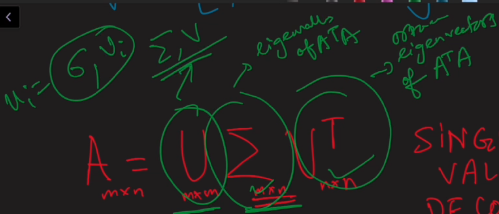
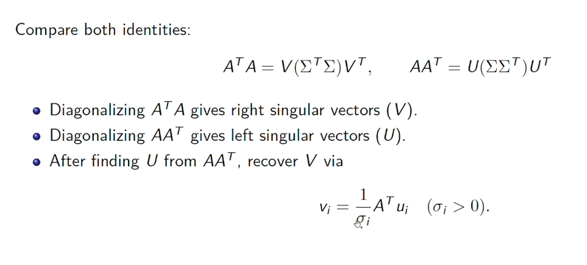
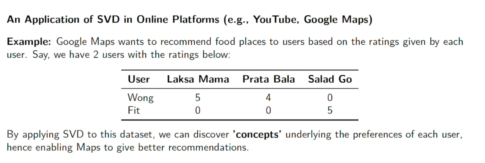
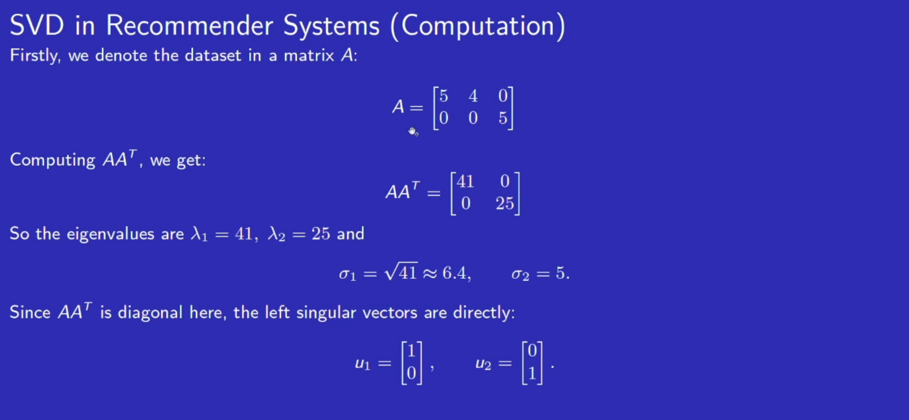
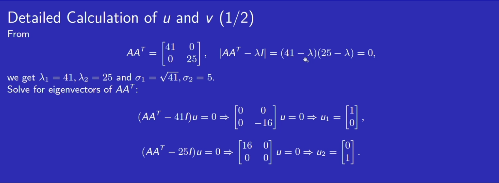
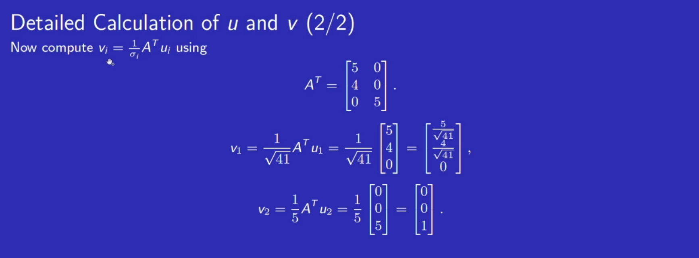
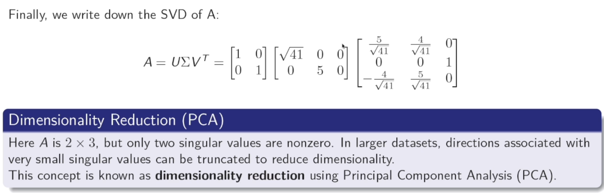
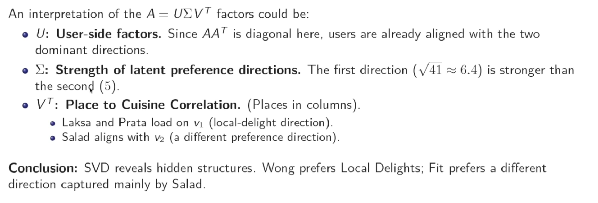
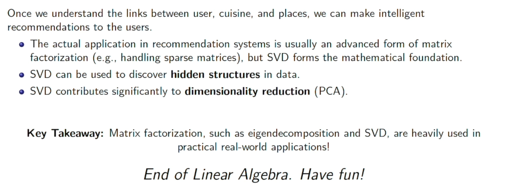

Square Matrix Decomposition: $A=PDP^{-1}$

Non-square matrix
- No determinant
- Do not possess traditional eigenvalues and eigenvectors

For a non square matrix A ($m\times n$),
- $A^TA$ is a ($n\times n$) matrix
- $A^TA=PDP^{-1}$ because its a 'nice' square matrix
- $A^TA$ is somewhat of a "square" of A
- Which to choose to diagonalise? $A^TA$ or $AA^T$ (a $m\times m$ matrix or $n\times n$)
	- choose the smallest, because manually doing the diagonalisation will be easier
	- smaller **eigenproblem**

Let us assume $A=U \Sigma V^T$ 
- where $\Sigma$ is the diagonal matrix
- $U \& V^T$ are **orthonormal** matrix
	- orthonormal matrices have the property: $OO^T=I, O^TO=I$
		- means $O^T=O^{-1}$
			- $O^T$ is equal to $O^{-1}$!!
		- means that $O$ is a square matrix
		- means they are also **invertible/nonsingular**
	- orthonormal matrices also have the property that their columns (or rows) are orthonormal vectors
		- orthonormal vector
			- orthogonality: **any column** $\vec{O_{i}}$ is perpendicular to **any column** $\vec{O_{j}}$
				- $\vec{O_{i}}\perp \vec{O_{j}}$
				- $\vec{O_{i}}~~\cdot~~\vec{O_{j}}=0$
				- 1 column vector is perpendicular to every other column vector
			- unit vector property: $||\vec{O_{j}}||=1$
			- they are independent from each other
			- orthonormal = orthogonal + unit

# Derivation of SVD Formula (A^TA)
Because we know $A^TA=PDP^{-1}$ and $A=U\Sigma V^T$

$$
\begin{gathered}
A^TA=(U\Sigma V^T)^T(U\Sigma V^T)\\
= (V\Sigma^TU^T)(U\Sigma V^T)\\
=V\Sigma^T(U^TU)\Sigma V^T\\
=V\Sigma^T~I~\Sigma V^T\\
=V\Sigma^T\Sigma V^T\\
=V\Sigma^{2}V^T~~~~~~ \leftarrow \text{Because }\Sigma\text{ is a diagonal matrix}\\
\color{white} \rule{8cm}{0.4pt}\\
A^TA=V\Sigma^{2}V^T\\
A^TA=PDP^{-1}\\

\end{gathered}
$$

From the above, P=V
- meaning that V is a matrix of eigenvectors that are orthonormal vectors
	- need to be perpendicular to one another, need to be unit vectors
From the above, $P^{-1}=V^T$
- where $V^T=V^{-1}$
From the above, $D=\Sigma^{2}$
- so $\Sigma=\sqrt{ D }=\begin{bmatrix}\sqrt{ \lambda_{1} } &  &  \\  & \sqrt{ \lambda_{2} } &  \\  &  & \ddots  &  \\  &  &  & \sqrt{ \lambda_{n} } \end{bmatrix}=\begin{bmatrix}\sigma_{1} &  &  \\  & \sigma_{2} &  \\  &  & \ddots  &  \\  &  &  & \sigma_{n} \end{bmatrix}$
- make sure to **square root!!**

$\Sigma$ is known as the singular value matrix
- $\sigma_{1},\sigma_{2},\dots,\sigma_{n}$ known as singular values

## Derivation of "U"
$$
\begin{gathered}
A=U\Sigma V^T\\
AV=U\Sigma V^TV\\
AV=U\Sigma\\
A\begin{bmatrix}
| & | & \cdots & | \\
v_{1} & v_{2} &\cdots & v_{n} \\
| & | & \cdots & |
\end{bmatrix}=\begin{bmatrix}
| & | & \cdots & | \\
u_{1} & u_{2} & \cdots & u_{n} \\
| & | & \cdots & |
\end{bmatrix}\begin{bmatrix}
\sigma _{1} & 0 & \cdots & 0 \\
0 & \sigma_{2} & \cdots & 0 \\
\vdots & \vdots & \ddots & \vdots \\
0 & 0 & \cdots & \sigma_{n} \\
0 & 0 & 0 & 0 \\
\vdots & \vdots & \vdots & \vdots
\end{bmatrix}\\
?=(m\times m)(m\times n)\\
\begin{bmatrix}
| & | & \cdots & | \\
Av_{1} & Av_{2} &\cdots & Av_{n} \\
| & | & \cdots & |
\end{bmatrix}=\begin{bmatrix}
| & | & \cdots & | \\
\sigma_{1} u_{1} & \sigma_{2}u_{2} & \cdots & \sigma_{3}u_{n} \\
| & | & \cdots & |
\end{bmatrix}\\
\color{white} \rule{8cm}{0.4pt}\\
Av_{1}=\sigma_{1}u_{1}\\
u_{1}=\frac{1}{\sigma_{1}}Av_{1}\\
u_{2}= \frac{1}{\sigma 2}Av_{2}\\
u_{i}=\frac{1}{\sigma_{i}}Av_{i}\\
\end{gathered}
$$

Finding the values of $\vec{u_{i}}$

$$
\begin{gathered}
U=\begin{bmatrix}
| & | & \cdots & | \\
u_{1} & u_{2} &\cdots & u_{m} \\
| & | & \cdots & |
\end{bmatrix}\\
\vec{u_{i}}=\frac{1}{\sigma_{i}}Av_{i}\\
\end{gathered}
$$

- $\sigma_{i}=\sqrt{ \lambda_{i} }$ 
	- $\lambda_{i}$ is the eigenvalue of $A^TA$ as discussed above
- $v_{i}$
	- $v_{i}$ is the orthonormal eigenvectors in $A^TA$
	- $V^T=\begin{bmatrix}| & | & \cdots & | \\ v_{1} & v_{2} & \cdots & v_{n} \\ | & | & \cdots & |\end{bmatrix}$
	- $|v_{i}|$ must be 1
- 
Finding the value of $u_{m}$
- Find the last vector 
	- that satisfies as a unit vector, and is orthogonal to other vectors in the orthonormal matrix
	- For $3\times 2$ orthonormal matrix:
		- $\vec{u_{3}}=\vec{u_{1}}\times \vec{u_{2}}=|\vec{u_{1}}||\vec{u_{2}}|\hat{n}$
			- $|\vec{u_{1}}|=1$ and $|\vec{u_{2}}|=1$
		- $\vec{u_{3}}=\hat{n}$

## Sigma is not a square matrix
Formula for A

$$
A=U\Sigma V^T
$$

U is a $m\times m$
$V^T$ is a $n\times n$
$\Sigma$ is a $m\times n$
- **CATCH:** its not a square matrix
- it will be a $\begin{bmatrix}\sqrt{ \lambda_{1} } & 0 & \cdots  & 0 \\ 0 & \sqrt{ \lambda_{2} } & \cdots & 0 \\ \vdots & \vdots & \ddots  &  \\ 0 & 0 & 0 & \sqrt{ \lambda_{n} } \\ 0 & 0 & 0 & 0 \\ 0 & 0 & 0 & 0 \end{bmatrix}$
	- extra 0s at the bottom for $(m-n)^{th}$ rows

# Example of SVD
Find Singular Value Decomposition of $A =\begin{bmatrix}1 & 2 \\ 2 & 2 \\ 2 & 1\end{bmatrix}$
- A is a $3\times 2$ matrix
- $A=U\Sigma V^T$
	- U is a 3 by 3 matrix
	- $\Sigma$ is a 3 by 2 matrix
	- $V^T$ is a 2 by 2 matrix
- Calculate $A^TA$
	- $A^T=\begin{bmatrix}1 & 2 & 2 \\ 2 & 2 & 1\end{bmatrix}$
	- $A^TA=\begin{bmatrix}1 & 2 & 2 \\ 2 & 2 & 1\end{bmatrix}\begin{bmatrix}1 & 2  \\ 2 & 2 \\ 2 & 1\end{bmatrix}=\begin{bmatrix}9 & 8 \\ 8 & 9\end{bmatrix}$
- Get Eigenvalues of $A^TA$
	- $|A^TA-\lambda I|=0$
		- $\begin{vmatrix}9-\lambda & 8 \\ 8 & 9-\lambda\end{vmatrix}=0$
		- $(9-\lambda)(9-\lambda)-64=0$
		- $81-9\lambda-9\lambda+\lambda^{2}-64=0$
		- $\lambda^{2}-18\lambda+17=0$
		- $\lambda_{1}=17,\lambda_{2}=1$
- $\Sigma=\sqrt{ D }=\begin{bmatrix}\sqrt{ 17 } & 0 \\0 & 1 \\ 0 & 0 \end{bmatrix}$
	- expand to correct size and pad with 0s
- V = eigenvectors of $A^TA$
	- $(A^TA-\lambda_{1} I)\vec{x}=0$
		- $\begin{bmatrix}9-17 & 8 \\ 8 & 9-17\end{bmatrix}\begin{bmatrix}x_{1} \\ x_{2}\end{bmatrix}=\begin{bmatrix}0  \\ 0\end{bmatrix}$
		- $-8x_{1}+8x_{2}=0$
		- $8x_{1}+(-8x_{2})=0$
		- $x_{1}=x_{2}$
		- Potential eigenvector: $\begin{bmatrix}1 \\ 1\end{bmatrix}$
		- Unit eigenvector: $\vec{v_{1}}=\begin{bmatrix} \frac{1}{\sqrt{ 2 }} \\ \frac{1}{\sqrt{ 2 }}\end{bmatrix}$
			- 
	- $(A^TA-\lambda_{2} I)\vec{x}=0$
		- $\begin{bmatrix}8 & 8 \\ 8 & 8\end{bmatrix}\vec{x}=0$
		- $8x_{1}+8x_{2}=0$
		- $8x_{1}+8x_{2}=0$
		- $x_{1}=-x_{2}$
		- Potential eigenvector: $\begin{bmatrix}-1 \\ 1\end{bmatrix}$
		- Magnitude: $\sqrt{ (-1)^{2}+1^{2} }=\sqrt{ 2 }$
		- Unit eigenvector: $\vec{v_{2}}\begin{bmatrix} -\frac{1}{\sqrt{ 2 }}  \\ \frac{1}{\sqrt{ 2 }}\end{bmatrix}$
	- V = matrix of eigenvectors
		- $\begin{bmatrix}| & | \\ v_{1} & v_{2} \\ | & |\end{bmatrix}=\begin{bmatrix} \frac{1}{\sqrt{ 2 }} & -\frac{1}{\sqrt{ 2 }} \\ \frac{1}{\sqrt{ 2 }} & \frac{1}{\sqrt{ 2 }} \end{bmatrix}$
- $U$
	- $u_{i}=\frac{1}{\sigma_{i}}Av_{i}$
		- where $\sigma_{i}$ is in $\Sigma$
		- where $v_{i}$ is in V
		- where A is **original matrix**
	- $u_{1}=\frac{1}{\sqrt{ 17 }}\begin{bmatrix}1 & 2 \\ 2 & 2 \\ 2 & 1\end{bmatrix}\begin{bmatrix} \frac{1}{\sqrt{ 2 }}  \\ \frac{1}{\sqrt{ 2 }}\end{bmatrix}$
	- $u_{1}= \frac{1}{\sqrt{ 17 }}\begin{bmatrix} \frac{3}{\sqrt{ 2 }} \\ \frac{4}{\sqrt{ 2 }} \\ \frac{3}{\sqrt{ 2 }}\end{bmatrix}$
	- $u_{1}=\frac{1}{\sqrt{ 34 }}\begin{bmatrix}3 \\ 4 \\ 3\end{bmatrix}$
	- $u_{2}=\begin{bmatrix}1 & 2 \\ 2 & 2 \\ 2 & 1\end{bmatrix}\begin{bmatrix}-\frac{1}{\sqrt{ 2 }} \\ \frac{1}{\sqrt{ 2 }}\end{bmatrix}$
	- $u_{2}=\begin{bmatrix} \frac{1}{\sqrt{ 2 }} \\ 0 \\ -\frac{1}{\sqrt{ 2 }}\end{bmatrix}$
	- $u_{2}=\frac{1}{\sqrt{ 2 }}\begin{bmatrix}1 \\ 0 \\ -1\end{bmatrix}$
	- $u_{3}=\vec{u_{1}}\times \vec{u_{2}}=|\vec{u_{1}}||\vec{u_{2}}|\hat{n}=\hat{n}$
		- Because magnitude of both vectors is just 1
		- $\hat{n}$ is perpendicular to both vectors
	- $u_{3}=\frac{1}{\sqrt{ 34 }}\begin{bmatrix}3 \\ 4 \\ 3\end{bmatrix}\times \frac{1}{\sqrt{ 2 }}\begin{bmatrix}1 \\ 0 \\ -1\end{bmatrix}=\begin{bmatrix} \frac{4}{\sqrt{ 34 }}\times\left( -\frac{1}{\sqrt{ 2 }} \right)-0 \\ \frac{3}{\sqrt{ 34 }}\times \frac{1}{\sqrt{ 2 }}-\frac{3}{\sqrt{ 34 }}\times-\frac{1}{\sqrt{ 2 }} \\ 0-\frac{4}{\sqrt{ 34 }}\times \frac{1}{\sqrt{ 2 }}\end{bmatrix}=\begin{bmatrix} -\frac{4}{\sqrt{ 68 }} \\ \frac{6}{\sqrt{ 68 }} \\ -\frac{4}{\sqrt{ 68 }}\end{bmatrix}=\begin{bmatrix}-\frac{4}{\sqrt{ 4\times 17 }} \\ \frac{6}{\sqrt{ 4\times 17 }}  \\ -\frac{4}{\sqrt{ 4\times 17 }}\end{bmatrix}=\begin{bmatrix}-\frac{2}{\sqrt{ 17 }} \\ \frac{3}{\sqrt{ 17 }} \\ -\frac{2}{\sqrt{ 17 }}\end{bmatrix}=\frac{1}{\sqrt{ 17 }}\begin{bmatrix}-2 \\ 3 \\ -2\end{bmatrix}$
		- use 
- $A=U\Sigma V^T$
- $A=\begin{bmatrix} \frac{3}{\sqrt{ 34 }}  & \frac{1}{\sqrt{ 2 }} & -\frac{2}{\sqrt{ 17 }}\\ \frac{4}{\sqrt{ 34 }} & 0 & \frac{3}{\sqrt{ 17 }} \\ \frac{3}{\sqrt{ 34 }} & -\frac{1}{\sqrt{ 2 }} & -\frac{2}{\sqrt{ 17 }} \end{bmatrix}\begin{bmatrix}\sqrt{ 17 } & 0 \\ 0 & 1 \\ 0 & 0\end{bmatrix}\begin{bmatrix} \frac{1}{\sqrt{ 2 }} & -\frac{1}{\sqrt{ 2 }} \\ \frac{1}{\sqrt{ 2 }} & \frac{1}{\sqrt{ 2 }}\end{bmatrix}^T$

# Comparing A^TA and AA^T

Need to use U to recover V instead:

$$
v_{i}=\frac{1}{\sigma_{i}}A^Tu_{i}
$$

- take note: **IT IS** $A^T$

# Applications of SVD: Recommender Systems

- Dimensionality reduction: reduce the amount of features 
- The U matrix shows the first user likes the first category while the second user likes the second category
- The Sigma matrix shows the importance of the 'likeness' where the first user likes the first cuisine of importance $\sqrt{ 41 }$ while the second user likes the second cuisine of importance 5
- The $V^T$ matrix shows the allocation of user preferences on cuisines mapped to the restaurants
	- The first row is the first user's preferences on both the laksa and prata restaurants (local cuisine)
	- The second row is the second user's preference on salad (healthy cuisine)

